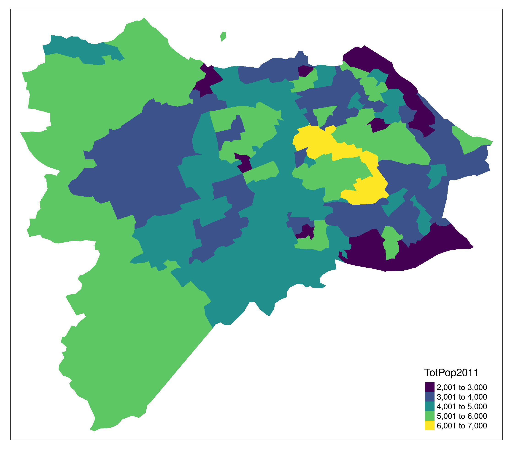

<!-- README.md is generated from README.Rmd. Please edit that file -->

```{r, include = FALSE}
knitr::opts_chunk$set(
  message = FALSE,
  collapse = TRUE,
  comment = "#>"
)
```

# Network Planning Tool for Scotland

<!-- badges: start -->
<!-- badges: end -->

The aim of this project is to generate evidence to support strategic cycle network planning in Scotland.

# Reproducibility: basic

To reproduce the basic results in this repository, hosted on GitHub at nptscot/npt, first download and unzip or clone it and then open the 'npt' folder in your favourite integrated development environment (IDE) for R, such as RStudio.

- You can download the repository as a zip file from the GitHub website by clicking on the green 'Code' button and selecting 'Download ZIP', hosted at this URL: https://www.github.com/nptscot/npt/archive/refs/heads/main.zip
- You can clone the repo with Git as follows:
  
  ```bash
  git clone https://www.github.com/nptscot/npt.git
  ```
- Or (recommended for future-proof workflows) you can install the GitHub CLI tool and clone the repo as follows:
  
  ```bash
  gh repo clone nptscot/npt
  ```

Install the GitHub CLI tools by following instructions here: https://cli.github.com/manual/installation

Note: you can check to see if you have the GitHub CLI tools installed by running the following command from the R console:

```{r}
gh_version = try({
  system("gh --version", intern = TRUE)
})
gh_version
if(is(gh_version, "try-error")) {
  message("You don't have the GitHub CLI tools installed. Please install them by following instructions here: https://cli.github.com/manual/installation")
}
```

## Set-up

We will use the following packages:

```{r, message=FALSE, warning=FALSE}
library(tidyverse)
library(tmap)
library(sf)
```
## Reading in input datasets

Read-in the input datasets as follows:

```{r}
list.files("data-raw")
od_data = read_csv("data-raw/od_subset.csv")
zones = read_sf("data-raw/zones_edinburgh.geojson")
desire_lines = od::od_to_sf(od_data, zones)
plot(desire_lines)
```

Generating route networks:

```{r}

# Create a subset of the desire lines for speed of computation:
desire_lines_subset = desire_lines |>
  slice_max(n = 30, order_by = all)
library(stplanr)
routes_subset = desire_lines_subset |>
  route(l = _, route_fun = route_osrm)
route_network = overline(routes_subset, attrib = "bicycle")
plot(route_network)
```

## Exercises to test your knowledge of the NPT approach

1. Read-in the [`od_subset.csv`](https://github.com/nptscot/npt/blob/main/data-raw/od_subset.csv) file containing origin-destination data in the [`data-raw`](https://github.com/nptscot/npt/blob/main/data-raw/) folder in this repo with the following command:

```{r, message=FALSE}
od_data = read.csv("https://github.com/nptscot/npt/raw/main/data-raw/od_subset.csv")
```

2. What's the average distance of trips according to the `dist_euclidean` column in that dataset?

3. The values in the `dist_euclidean` column represent straight line distance between zone centroids. In what way could the values be over or under-estimates of the distances of trips taken between the OD pairs?

4. Use the function `od_to_sf()` to convert the OD data into desire lines. Hint: a starting point could be:

```{r, message=FALSE}
zones = sf::read_sf("https://github.com/nptscot/npt/raw/main/data-raw/zones_edinburgh.geojson")
plot(zones$geometry)
```

**Bonus exercises**

1. Using interactive geographic data visualisation packages such as `tmap` and `leaflet`, visualise the desire lines and route network on a map? Which road links are most important for cycling according to the network results?


2. Using the `pct::uptake_pct_godutch_2020()` function estimate the potential uptake of cycling based on the subset of desire lines created above. What is the total level of cycling resulting from thhat uptake?

3. Using the `osmextract` or `osmdata` packages, or equivalent packages written in another language, identify the OSM ways that lie completely within a 500m buffer of the route network. How can you ensure that the results are reproducible?

4. Bonus: think about ways to identify weak links or gaps in the cycle network based on the small datasets analysed. How could you scale this up to the whole of Scotland?

# Reproducibility

Note: to reproduce the full build process currently depends on data sources and dependencies that are not publicly available. This is a work in progress.

Then run the following command (requires dependencies and data to be present):

```{r, eval=FALSE, echo=FALSE}
targets::tar_make()
```

Note: you need to have a CYCLESTREETS API key for this, see here for details: https://rpackage.cyclestreets.net/reference/journey.html#details-1

This project uses `targets` for data processing pipeline management, with outputs like this:


Visualise the project as follows:

```{r visnet}
# targets::tar_visnetwork(targets_only = TRUE)
```

The zones in the case study region are as follows:

```{r zones, echo=FALSE, eval=FALSE}
# targets::tar_load(zones)
# 
tmap_mode("plot")
tm_shape(zones) +
  tm_polygons(col = "TotPop2011", palette = "viridis")
```

Baseline cycling levels are shown below:

```{r overline, eval=FALSE}
tm_shape(rnet) +
  tm_lines(lwd = "bicycle", scale = 9)
```

