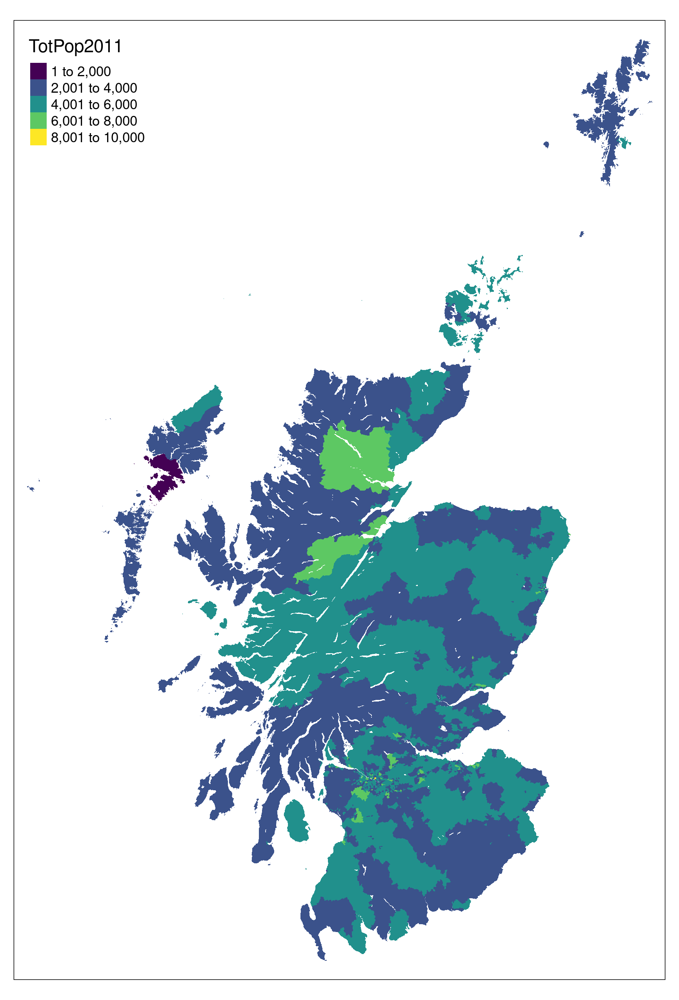

<!-- README.md is generated from README.Rmd. Please edit that file -->

```{r, include = FALSE}
knitr::opts_chunk$set(
  message = FALSE,
  collapse = TRUE,
  comment = "#>"
)
```

# atumscot

<!-- badges: start -->
<!-- badges: end -->

To reproduced code in this repository run the following command (requires dependencies and data to be present):

```{r, eval=FALSE}
targets::tar_make()
```

Visualise the project as follows:

```{r visnet}
targets::tar_visnetwork(targets_only = TRUE)
```


```{r, echo=FALSE}

```

