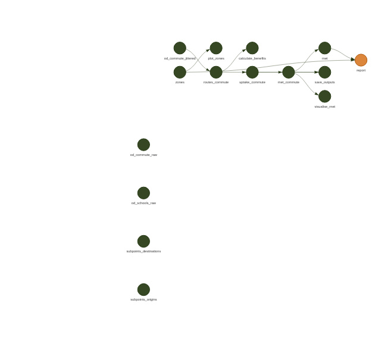

<!-- README.md is generated from README.Rmd. Please edit that file -->

# atumscot

<!-- badges: start -->
<!-- badges: end -->

To reproduced code in this repository run the following command
(requires dependencies and data to be present):

``` r
targets::tar_make()
```

Visualise the project as follows:

``` r
targets::tar_visnetwork(targets_only = TRUE)
#> ── Attaching packages ─────────────────────────────────────── tidyverse 1.3.1 ──
#> ✔ ggplot2 3.4.0      ✔ purrr   0.3.5 
#> ✔ tibble  3.1.8      ✔ dplyr   1.0.10
#> ✔ tidyr   1.2.1      ✔ stringr 1.4.1 
#> ✔ readr   2.1.3      ✔ forcats 0.5.2 
#> ── Conflicts ────────────────────────────────────────── tidyverse_conflicts() ──
#> ✖ dplyr::filter() masks stats::filter()
#> ✖ dplyr::lag()    masks stats::lag()
```

<!-- -->

The zones in the case study region are as follows:

<!-- -->
