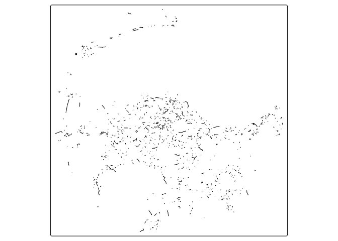
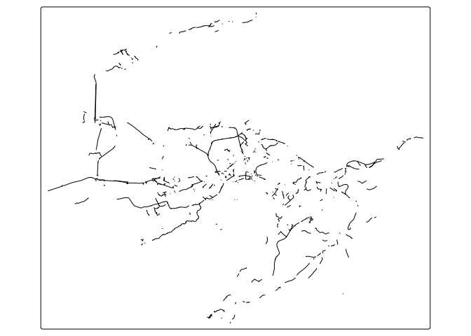
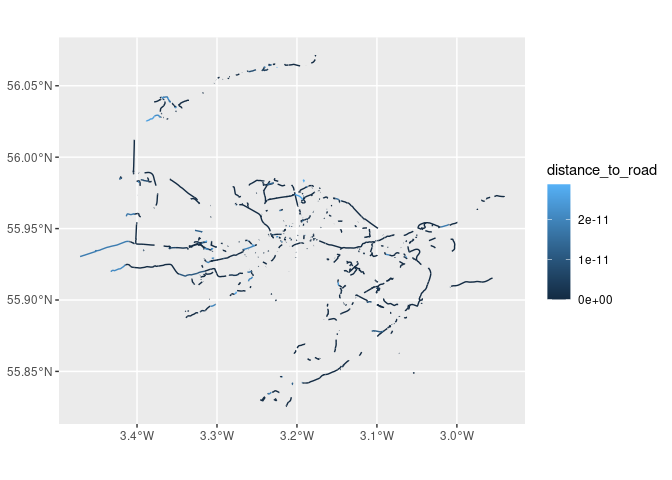
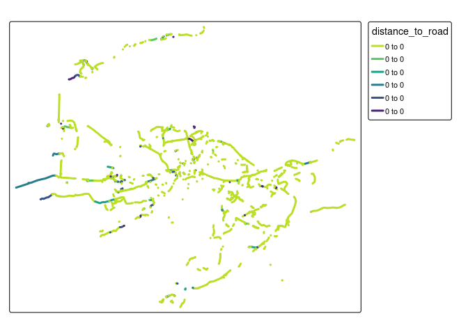
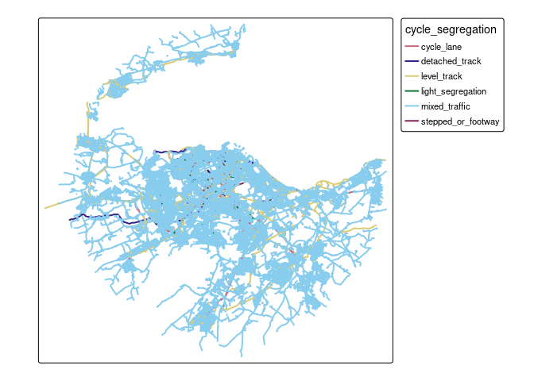

Load the data:

``` r
# Cycling by design compliance
library(tidyverse)
library(targets)
library(sf)
library(tmap)
tmap_mode("view")
```

    tmap mode set to 'view'

``` r
sys_date = "2024-04-04"
study_area = zonebuilder::zb_zone("Edinburgh")

# Download osm data
et = c(
  "maxspeed",
  "oneway",
  "bicycle",
  "cycleway",
  "cycleway:left",
  "cycleway:right",
  "cycleway:both",
  "lanes",
  "lanes:both_ways",
  "lanes:forward",
  "lanes:backward",
  "lanes:bus",
  "lanes:bus:conditional",
  "oneway",
  "width",      # useful to ensure width of cycleways is at least 1.5m
  "segregated"  # classifies whether cycles and pedestrians are segregated on shared paths
#  "sidewalk",
#  "ref",
#  "surface",
#  "route",           # for proposed routes
#  "state",
#  "lcn",
#  "rcn",
#  "ncn",
#  "network"
)
```

``` r
# Read-in road network data
osm_lines = osmextract::oe_get_network(
  place = "Scotland",
  mode = "cycling",
  extra_tags = et
  # , force_download = TRUE # keep it up-to date
)

# Simple exploratory analysis
# identify services, these are service stations, not realistic cycle trip start/end points
# osm_lines %>%
#   filter(highway == "services") %>%
#   qtm()
# osm_lines %>%
#   filter(highway == "rest_area") %>%
#   qtm()
# osm_lines %>%
#   filter(highway == "track") %>%
#   sample_n(200) %>% 
#   qtm()
# osm_lines %>%
#   filter(highway == "trunk") %>%
#   sample_n(500) %>% 
#   qtm()

to_exclude = "motorway|services|bridleway|disused|emergency|escap|far|foot|path|rest|road|track"

osm_highways = osm_lines %>%
  filter(
    !str_detect(string = highway, pattern = to_exclude),
    is.na(bicycle)|!str_detect(string = bicycle, pattern = "mtb|discouraged|unknown"),
    !(str_detect(string = highway, pattern = "pedestrian")& !str_detect(string = bicycle, pattern = "designated"))
  )


dim(osm_highways) 
# [1] 438090     27

save_name = paste0("inputdata/osm_highways_",sys_date,".Rds")
saveRDS(osm_highways, save_name)
# osm_highways = readRDS("inputdata/osm_highways_2024-04-04.Rds")

names(osm_highways)
# [1] "osm_id"                "name"                  "highway"              
# [4] "waterway"              "aerialway"             "barrier"              
# [7] "man_made"              "access"                "bicycle"              
# [10] "service"               "maxspeed"              "oneway"               
# [13] "cycleway"              "cycleway_left"         "cycleway_right"       
# [16] "cycleway_both"         "lanes"                 "lanes_both_ways"      
# [19] "lanes_forward"         "lanes_backward"        "lanes_bus"            
# [22] "lanes_bus_conditional" "width"                 "segregated"           
# [25] "z_order"               "other_tags"            "geometry" 
summary(osm_highways)

osm_cyclenet = osm_highways %>%
    select(osm_id, name, highway, maxspeed, bicycle, 
    cycleway, cycleway_left, cycleway_right, cycleway_both, 
    lanes, lanes_both_ways, lanes_forward, lanes_backward, 
    lanes_bus, lanes_bus_conditional, oneway, width, segregated)

cyclenet_study = osm_cyclenet[study_area, ]

names(osm_cyclenet)
# [1] "osm_id"                "name"                  "highway"              
# [4] "maxspeed"              "bicycle"               "cycleway"             
# [7] "cycleway_left"         "cycleway_right"        "cycleway_both"        
# [10] "lanes"                 "lanes_both_ways"       "lanes_forward"        
# [13] "lanes_backward"        "lanes_bus"             "lanes_bus_conditional"
# [16] "oneway"                "width"                 "segregated"           
# [19] "geometry" 

# Investigate which values are in use

unique(osm_cyclenet$highway)
# [1] "residential"    "trunk"          "primary"        "secondary"      "tertiary"       "primary_link"  
# [7] "trunk_link"     "unclassified"   "service"        "pedestrian"     "tertiary_link"  "cycleway"      
# [13] "secondary_link" "living_street"  "busway"         "crossing"
unique(osm_cyclenet$cycleway)
#  [1] NA                      "lane"                  "advisory"             
#  [4] "no"                    "share_busway"          "track"                
#  [7] "opposite"              "opposite_lane"         "yes"                  
# [10] "opposite_share_busway" "shared"                "shared_lane"          
# [13] "separate"              "opposite_track"        "segregated"           
# [16] "mtb"                   "crossing"              "sidepath"             
# [19] "none"                  "sidewalk"              "left"                 
# [22] "unmarked_lane"         "traffic_island" 
unique(osm_cyclenet$cycleway_left)
# [1] NA              "no"            "track"         "lane"         
# [5] "share_busway"  "shared_lane"   "separate"      "segregated"   
# [9] "advisory"      "buffered_lane" "yes"
unique(osm_cyclenet$cycleway_right)
# [1] NA              "shared_lane"   "track"         "lane"         
# [5] "no"            "share_busway"  "separate"      "opposite_lane"
# [9] "opposite"      "shared" 
unique(osm_cyclenet$cycleway_both)
# [1] "no"           NA             "lane"         "share_busway" "separate"    
# [6] "track"        "shared_lane"  "shoulder" 
unique(osm_cyclenet$maxspeed)
# [1] "20 mph"  "30 mph"  "70 mph"  "50 mph"  NA        "40 mph"  "60 mph" 
# [8] "10 mph"  "5 mph"   "signals" "15 mph"  "15"      "25 mph"  "11 mph" 
# [15] "50"      "9 mph"   "8 mph"   "4 mph"   "5"       "8"   

# There are assumptions in OSM about the number of lanes for all roads smaller than trunk/motorway
# So when there are NA values we can assume there is 1 lane 
unique(osm_cyclenet$lanes)
# [1] NA    "2"   "4"   "1"   "3"   "6"   "5"   "1.5" "0" 
unique(osm_cyclenet$lanes_both_ways)
# [1] NA  "1"
unique(osm_cyclenet$lanes_forward)
# [1] NA  "2" "1" "3"
unique(osm_cyclenet$lanes_backward)
# [1] NA  "1" "2" "4" "3"
unique(osm_cyclenet$lanes_bus)
# [1] NA                   "1"                  "yes|yes|designated"
unique(osm_cyclenet$lanes_bus_conditional) # This tag seems to be unusued
# [1] NA

unique(osm_cyclenet$bicycle)
# [1] NA            "designated"  "yes"         "dismount"    "permissive" 
# [6] "customers"   "destination" "mtb"         "discouraged" "unknown" 

unique(osm_cyclenet$oneway)
# [1] NA            "yes"         "no"          "-1"          "alternating"
# [6] "reversible" 
unique(osm_cyclenet$width)
# [1] NA       "5.3"    "5.5"    "5.2"    "4.2"    "2.5 m"  "2.0 m"  "5.6"   
# [9] "8.6"    "10"     "6.5"    "6"      "4.8"    "2.5"    "6.0"    "2.2"   
# [17] "2"      "3"      "4"      "10.4"   "7.2"    "6.1"    "9"      "5.8"   
# [25] "7.5"    "9.1"    "7.3"    "2.75"   "8"      "4.9"    "6.7"    "2.3"   
# [33] "7.8"    "3.2"    "4.5"    "8.5"    "3.1"    "7"      "2.25"   "1.5"   
# [41] "1"      "0.75"   "1.75"   "9.3"    "5.9"    "7.9"    "8.1"    "3.6"   
# [49] "5"      "6.2"    "4.3"    "11"     "1.8"    "3.5"    "11.1"   "9.8"   
# [57] "4.4"    "11.5"   "8.3"    "8.8"    "12"     "7.1"    "4.7"    "4.1"   
# [65] "6.3"    "6.6"    "7.7"    "9.5"    "13"     "10.5"   "2.7"    "13.5"  
# [73] "5.4"    "4.6"    "5.1"    "5.0"    "5.7"    "8.4"    "8.2"    "2.4"   
# [81] "2.6"    "12.8"   "3.3"    "9 m"    "0.5"    "12.5"   "6.9"    "6.8"   
# [89] "narrow" "6.4"    "9.6"    "2.8"    "3.9"    "2m"     "15"     "3.4"   
# [97] "9.0"    "5.5."   "4.0"    "3.0"    "3.8"    "7.4"    "10m"    "3m"    
# [105] "3.7"    "1.6"    "10.0"   "1.1"    "1.5 m"  "1.9"    "8.0"    "11.0"  
# [113] "14"     "4.85"   "2.9"    "8.9"    "0.7"    "1m"     "20"     "5.5 m" 
# [121] "7.0"    "3.75"   "1.75m"  "1.2"    "0.75m"  "1.5m"   "2.3 m"  "16.5"  
# [129] "2.0"    "2.0m"   "4.0m"   "2.1"    "1.4"    "4m"     "1.6 m"  "8.7"   
# [137] "0.5 m"  "4.75"   ".8"     "5'6\""  "11.8"   "14.9"   "10.1"   "2.65"  
# [145] "14.8"   "18"     "17"     "5.9 m" 
unique(osm_cyclenet$segregated)
# [1] NA    "yes" "no"
unique(osm_cyclenet$highway)
#  [1] "residential"    "trunk"          "primary"        "secondary"     
# [5] "tertiary"       "primary_link"   "trunk_link"     "unclassified"  
# [9] "service"        "tertiary_link"  "cycleway"       "secondary_link"
# [13] "living_street"  "busway"         "crossing"

# Busways are ok to cycle on (there's only a couple in Scotland anyway) - FINE
busway = osm_cyclenet |> 
  filter(highway == "busway")
tm_shape(busway) + tm_lines()
# This is just a single lane track in Orkney - FINE
zero_lane = osm_cyclenet |> 
  filter(lanes == "0")
tm_shape(zero_lane) + tm_lines()
# This is a few small roads that can be treated as single lane - FINE
half_lane = osm_cyclenet |> 
  filter(lanes == "1.5")
tm_shape(half_lane) + tm_lines()
# A couple of dead-end tracks - REMOVE
mtb = osm_cyclenet |> 
  filter(bicycle == "mtb")
tm_shape(mtb) + tm_lines()
# dead end track - REMOVE
unknown = osm_cyclenet |> 
  filter(bicycle == "unknown")
tm_shape(unknown) + tm_lines()
# Towpath section, onroad tram route, pedestrian crossing, etc - KEEP
dismount = osm_cyclenet |> 
  filter(bicycle == "dismount")
tm_shape(dismount) + tm_lines()

# Categorise segregation --------------------------------------------------

# The categories are:
# detached_track
# level_track
# stepped_or_footway
# light_segregation
# cycle_lane
# mixed_traffic

# Check segregation categories in Scotland or Edinburgh

# there are very few of these and most seem to be stepped_or_footway
separate = osm_cyclenet |> 
  filter(cycleway == "separate")
tm_shape(separate) + tm_lines()
# one single road segment with unclear (post-google streetview) cycle infrastructure
buffered = osm_cyclenet |> 
  filter(cycleway_left == "buffered_lane")
tm_shape(buffered) + tm_lines()
# Very few, unclear but seem to be pedestrian level
segway = osm_cyclenet |> 
  filter(cycleway == "segregated")
tm_shape(segway) + tm_lines()

# These are off-road paths shared with pedestrians
segno = cyclenet_study |> 
  filter(segregated == "no")
tm_shape(segno) + tm_lines()
# These are more mixed - some fully kerbed, others footway level/shared with pedestrians
segyes = cyclenet_study |> 
  filter(segregated == "yes")
tm_shape(segyes) + tm_lines()

# Classic painted cycle lane
lane_values = c(
  "lane",
  "opposite_lane"
)
track_values = c(
  "track"
)
lane = cyclenet_study |> 
  filter(
    cycleway %in% lane_values |
      cycleway_left %in% lane_values |
      cycleway_right %in% lane_values |
      cycleway_both %in% lane_values
  )
nrow(lane)
table(cyclenet_study$cycleway_left)
table(cyclenet_study$cycleway_right)
table(cyclenet_study$cycleway_both)
tm_shape(lane) + tm_lines()

# Light segregation with orca wands
# 
track = cyclenet_study |> 
  filter(
    cycleway %in% track_values |
      cycleway_left %in% track_values |
      cycleway_right %in% track_values |
      cycleway_both %in% track_values
  )
nrow(track)
tm_shape(track) + tm_lines()

# Mostly detached/remote, but also some adjacent to highways as 'level_track'
# We need to filter using distance from highway
det = cyclenet_study |> 
  filter(highway == "cycleway")
tm_shape(det) + tm_lines()

# segregated == no |> stepped_or_footway


# Function for level_track v detached_track

# Make a 10m buffer around highway==cycleway
# If other highways appear within this buffer, it's a level_track
# If no other highways appear, it's a detached track
osm_buffer = cyclenet_study |> 
  filter(highway == "cycleway")
osm_buffer = osm_buffer |> 
  sf::st_buffer(10) # could change to 10m
# tm_shape(osm_buffer) + tm_lines()
saveRDS(osm_buffer, "inputdata/osm_buffer.Rds")


# Get all roads (with mode = driving) -------------------------------------

# Read-in road network data
osm_roads = osmextract::oe_get_network(
  place = "Scotland",
  mode = "driving",
  extra_tags = et
  # , force_download = TRUE # keep it up-to date
)

table(osm_roads$highway)
# busway       crossing        disused  emergency_bay         escape  living_street       motorway  motorway_link 
# 17              3              1              2              1            504           1255            917 
# primary   primary_link        raceway    residential      rest_area           road      secondary secondary_link 
# 18299            706            106         117538             13             17          13460            138 
# service       services       tertiary  tertiary_link          track          trunk     trunk_link   unclassified 
# 219127              9          20268            166          97645           6329            924          32029

to_exclude = "crossing|services|disused|emergency|escap|far|raceway|rest|road|track"

# road = osm_lines |> 
#   filter(highway == "services")
# tm_shape(road) + tm_lines()

osm_roads = osm_roads |> 
  filter(!str_detect(string = highway, pattern = to_exclude))

# Save cyclenet_study:
saveRDS(cyclenet_study, "inputdata/cyclenet_study.Rds")
save_name = paste0("inputdata/osm_roads_",sys_date,".Rds")
saveRDS(osm_roads, save_name)
```

``` r
# Start here  -------------------------------------------------------------
# list.files("inputdata", pattern = "osm_roads")
osm_roads = readRDS(here::here("inputdata/osm_roads.Rds"))
cyclenet_study = readRDS(here::here("inputdata/cyclenet_study.Rds"))
roads_study = osm_roads[study_area, ]
# table(osm_roads$highway)

# Plot roads_study
roads_study |> 
  sample_n(1000) |>
  select(highway) |> 
  qtm()
```



``` r
# segregated = osm_segregation |> 
#   filter(cycle_segregation %in% c("detached_track", "level_track"))
segregated = cyclenet_study |> 
  filter(highway == "cycleway"|highway == "pedestrian")

# Aim: calculate distance from the cyclenet_study object to the nearest road
segregated_points = sf::st_point_on_surface(segregated)
```

    Warning: st_point_on_surface assumes attributes are constant over geometries

    Warning in st_point_on_surface.sfc(st_geometry(x)): st_point_on_surface may not
    give correct results for longitude/latitude data

``` r
# # Check stplanr:
# segregated_point2 = stplanr::line_midpoint(segregated) |> 
#   sf::st_as_sf()
# 
# bench::mark(check = FALSE,
#   stplan = stplanr::line_midpoint(segregated) |> sf::st_as_sf(),
#   sf = sf::st_point_on_surface(segregated)
# )

# # Check for one point
# segregated |> 
#   slice(1) |> 
#   tm_shape() + tm_lines() +
#   tm_shape(segregated_points |> slice(1)) + tm_dots(size = 2, alpha = 0.1) +
#   tm_shape(segregated_point2 |> slice(1)) + tm_dots(size = 1, alpha = 0.5)

# Distance to nearest road:

roads_union = roads_study |> 
  sf::st_union() |> 
  sf::st_transform(27700)

# distances_to_roads = sf::st_distance(segregated_points, roads_study)

# Try with geos pkg
roads_geos = geos::as_geos_geometry(roads_union)
points_geos = geos::as_geos_geometry(segregated_points |>  sf::st_transform(27700))
points_distances = geos::geos_distance(points_geos, roads_geos)
head(points_distances)
```

    [1] 1.436644e+02 0.000000e+00 0.000000e+00 0.000000e+00 0.000000e+00
    [6] 2.481355e-11

``` r
summary(points_distances)
```

       Min. 1st Qu.  Median    Mean 3rd Qu.    Max. 
      0.000   0.000   0.000   1.451   0.000 259.963 

``` r
# Min. 1st Qu.  Median    Mean 3rd Qu.    Max. 
# 0.000   5.793  11.840  32.093  35.888 727.403

segregated$distance_to_road = points_distances
# plot the most remote ones
tmap_mode("plot")
```

    tmap mode set to 'plot'

``` r
segregated |> 
  arrange(desc(distance_to_road)) |> 
  head(1000) |>
  qtm()
```



``` r
  # ggplot() +
  # geom_sf(aes(color = distance_to_road)) 

segregated |> 
  arrange(distance_to_road) |> 
  head(1000) |>
  ggplot() +
  geom_sf(aes(color = distance_to_road)) 
```



``` r
segregated |> 
  arrange(distance_to_road) |> 
  head(1000) |> 
  tm_shape() + tm_lines("distance_to_road", lwd = 3, palette = "viridis")
```

    tm_lines: Deprecated tmap v3 code detected. Code translated to v4



``` r
# Categorise the cycleway types -------------------------------------------

segregated = segregated |> 
  mutate(type = case_when(
    grepl("Path", name, fixed = TRUE) ~ "detached_track",
    grepl("Towpath", name, fixed = TRUE) ~ "detached_track",
    distance_to_road > 10 ~ "detached_track",
    TRUE ~ "level_track"
  ))

segregated |> 
  filter(type == "detached_track") |> 
  tm_shape() + tm_lines()
```


``` r
segregated |> 
  filter(type == "level_track") |> 
  tm_shape() + tm_lines()
```


``` r
# Join with original cycle network
seg_type = sf::st_drop_geometry(segregated)
seg_type = seg_type |> 
  select(osm_id, distance_to_road, type)
cyclenet_joined = cyclenet_study |> 
  left_join(seg_type, by = "osm_id")

# Function to take OSM data and return cycleway type: ---------------------

# Define the cycle route types:
osm_segregation = cyclenet_joined |>
  mutate(cycle_segregation = case_when(
    
    # Where highway == cycleway
    type == "detached_track" ~ "detached_track",
    type == "level_track" ~ "level_track",
    
    # Cycleways on road
    cycleway == "lane" ~ "cycle_lane",
    cycleway_right == "lane" ~ "cycle_lane",
    cycleway_left == "lane" ~ "cycle_lane",
    cycleway_both == "lane" ~ "cycle_lane",
    
    cycleway == "track" ~ "light_segregation",
    cycleway_left == "track" ~ "light_segregation",
    cycleway_right == "track" ~ "light_segregation",
    cycleway_both == "track" ~ "light_segregation",
    
    
    # Shared with pedestrians (but not highway == cycleway)
    segregated == "no" ~ "stepped_or_footway",
    segregated == "yes" ~ "stepped_or_footway",
    
    # Rare cases
    cycleway == "separate" ~ "stepped_or_footway",
    cycleway_left == "separate" ~ "stepped_or_footway",
    cycleway_right == "separate" ~ "stepped_or_footway",
    cycleway_both == "separate" ~ "stepped_or_footway",
    cycleway == "buffered_lane" ~ "cycle_lane",
    cycleway_left == "buffered_lane" ~ "cycle_lane",
    cycleway_right == "buffered_lane" ~ "cycle_lane",
    cycleway_both == "buffered_lane" ~ "cycle_lane",
    cycleway == "segregated" ~ "stepped_or_footway",
    cycleway_left == "segregated" ~ "stepped_or_footway",
    cycleway_right == "segregated" ~ "stepped_or_footway",
    cycleway_both == "segregated" ~ "stepped_or_footway",
    
    # Default mixed traffic
    .default = "mixed_traffic"
  )
  )

# saveRDS(osm_segregation, "inputdata/osm_segregation_2024-04-04.Rds")

table(osm_segregation$cycle_segregation)
```


            cycle_lane     detached_track        level_track  light_segregation 
                   283                153               1326                 87 
         mixed_traffic stepped_or_footway 
                 32740                103 

``` r
# cycle_lane     detached_track        level_track  light_segregation      mixed_traffic stepped_or_footway 
# 288               1389               1164                105              48966                116

# Even with arrange it still plots mixed_traffic routes on top of others
osm_segregation |> 
  arrange(cycle_segregation) |> 
  tm_shape() + tm_lines("cycle_segregation", lwd = 2)
```



``` r
# Classify by maxspeed ----------------------------------------------------

table(osm_segregation$maxspeed)
```


    10 mph     15 15 mph 20 mph 30 mph 40 mph  5 mph 50 mph 60 mph 70 mph 
       178      1     72  11265   3149    827     61    116    535     17 

``` r
# 10 mph     15 15 mph 20 mph 30 mph 40 mph      5  5 mph 50 mph 60 mph 70 mph 
# 218      1    118  15410   7431   1372      1     82    390    983     49

osm_speeds = osm_segregation |> 
  mutate(maxspeed = gsub("[ mph]", "", maxspeed),
         maxspeed = as.numeric(maxspeed))
table(osm_speeds$maxspeed)
```


        5    10    15    20    30    40    50    60    70 
       61   178    73 11265  3149   827   116   535    17 

``` r
# 10    15    20    30    40     5    50    60    70 
# 218   119 15410  7431  1372    83   390   983    49 

# Get speed limits for the roads near to level_tracks

level = osm_speeds |> 
  filter(cycle_segregation == "level_track")
table(level$maxspeed)
```


    15 20 
     1 23 

``` r
stepped = osm_speeds |> 
  filter(cycle_segregation == "stepped_or_footway")
table(stepped$maxspeed)
```


    20 30 
    90  9 

``` r
summary(stepped)
```

        osm_id              name             highway             maxspeed    
     Length:103         Length:103         Length:103         Min.   :20.00  
     Class :character   Class :character   Class :character   1st Qu.:20.00  
     Mode  :character   Mode  :character   Mode  :character   Median :20.00  
                                                              Mean   :20.91  
                                                              3rd Qu.:20.00  
                                                              Max.   :30.00  
                                                              NA's   :4      
       bicycle            cycleway         cycleway_left      cycleway_right    
     Length:103         Length:103         Length:103         Length:103        
     Class :character   Class :character   Class :character   Class :character  
     Mode  :character   Mode  :character   Mode  :character   Mode  :character  
                                                                                
                                                                                
                                                                                
                                                                                
     cycleway_both         lanes           lanes_both_ways    lanes_forward     
     Length:103         Length:103         Length:103         Length:103        
     Class :character   Class :character   Class :character   Class :character  
     Mode  :character   Mode  :character   Mode  :character   Mode  :character  
                                                                                
                                                                                
                                                                                
                                                                                
     lanes_backward      lanes_bus         lanes_bus_conditional    oneway         
     Length:103         Length:103         Length:103            Length:103        
     Class :character   Class :character   Class :character      Class :character  
     Mode  :character   Mode  :character   Mode  :character      Mode  :character  
                                                                                   
                                                                                   
                                                                                   
                                                                                   
        width            segregated        distance_to_road     type          
     Length:103         Length:103         Min.   : NA      Length:103        
     Class :character   Class :character   1st Qu.: NA      Class :character  
     Mode  :character   Mode  :character   Median : NA      Mode  :character  
                                           Mean   :NaN                        
                                           3rd Qu.: NA                        
                                           Max.   : NA                        
                                           NA's   :103                        
              geometry   cycle_segregation 
     LINESTRING   :103   Length:103        
     epsg:4326    :  0   Class :character  
     +proj=long...:  0   Mode  :character  
                                           
                                           
                                           
                                           

``` r
# TODO: complete this with reference to speeds and volumes
osm_speeds = osm_speeds |> 
  mutate(level_of_service = case_when(
    cycle_segregation == "detached_track" ~ "high",
    cycle_segregation == "level_track" ~ "medium",
    cycle_segregation == "light_segregation" ~ "medium",
    cycle_segregation == "cycle_lane" ~ "medium",
    cycle_segregation == "stepped_or_footway" ~ "medium",
    cycle_segregation == "mixed_traffic" ~ "low"
  ))

cycleway_type = function(cyclenet_study) {
  # ...
  res = case_when(
    cyclenet_study$highway == "cycleway" ~ "detached_track",
    TRUE ~ "mixed_traffic"
  )
  return(res)
}

# Test the function
cycleway_types = cycleway_type(cyclenet_study)
table(cycleway_types)
```

    cycleway_types
    detached_track  mixed_traffic 
              1431          33261 
