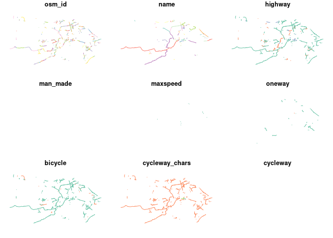
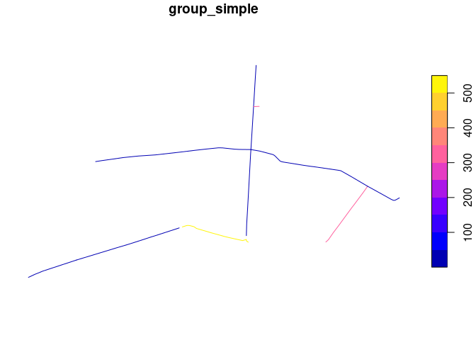
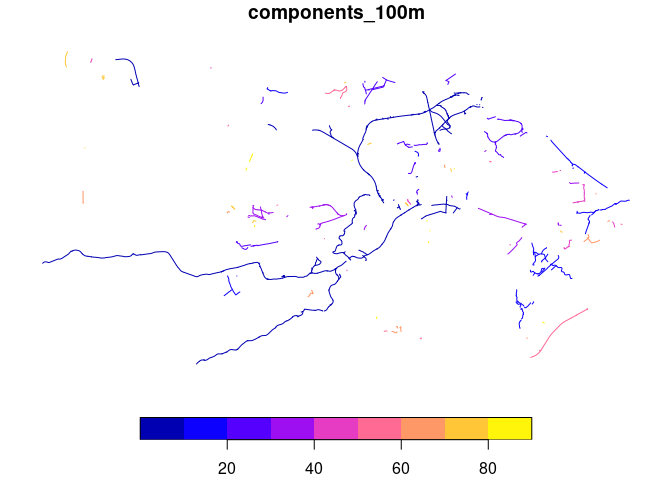

``` r
library(sfnetworks)
library(sf)
```

    Linking to GEOS 3.12.1, GDAL 3.8.4, PROJ 9.3.1; sf_use_s2() is TRUE

``` r
library(tidygraph)
```


    Attaching package: 'tidygraph'

    The following object is masked from 'package:stats':

        filter

``` r
library(tidyverse)
```

    ── Attaching core tidyverse packages ──────────────────────── tidyverse 2.0.0 ──
    ✔ dplyr     1.1.4     ✔ readr     2.1.5
    ✔ forcats   1.0.0     ✔ stringr   1.5.1
    ✔ ggplot2   3.5.1     ✔ tibble    3.2.1
    ✔ lubridate 1.9.3     ✔ tidyr     1.3.1
    ✔ purrr     1.0.2     

    ── Conflicts ────────────────────────────────────────── tidyverse_conflicts() ──
    ✖ dplyr::filter() masks tidygraph::filter(), stats::filter()
    ✖ dplyr::lag()    masks stats::lag()
    ℹ Use the conflicted package (<http://conflicted.r-lib.org/>) to force all conflicts to become errors

``` r
library(igraph)
```


    Attaching package: 'igraph'

    The following objects are masked from 'package:lubridate':

        %--%, union

    The following objects are masked from 'package:dplyr':

        as_data_frame, groups, union

    The following objects are masked from 'package:purrr':

        compose, simplify

    The following object is masked from 'package:tidyr':

        crossing

    The following object is masked from 'package:tibble':

        as_data_frame

    The following object is masked from 'package:tidygraph':

        groups

    The following objects are masked from 'package:stats':

        decompose, spectrum

    The following object is masked from 'package:base':

        union

``` r
library(mapview)
library(dplyr)
```

``` r
f = "inputdata/boundaries/la_regions_2023.geojson"
if (!file.exists(f)) {
    f = "../../inputdata/boundaries/la_regions_2023.geojson"
}
lads = sf::read_sf(f) |> filter(LAD23NM == "City of Edinburgh") |> sf::st_transform(27700)

osm = osmactive::get_travel_network("Scotland", boundary = lads, boundary_type = "clipsrc")
```

    The input place was matched with: Scotland

    Downloading the OSM extract:


      |                                                                            
      |                                                                      |   0%
      |                                                                            
      |                                                                      |   1%
      |                                                                            
      |=                                                                     |   1%
      |                                                                            
      |=                                                                     |   2%
      |                                                                            
      |==                                                                    |   2%
      |                                                                            
      |==                                                                    |   3%
      |                                                                            
      |==                                                                    |   4%
      |                                                                            
      |===                                                                   |   4%
      |                                                                            
      |===                                                                   |   5%
      |                                                                            
      |====                                                                  |   5%
      |                                                                            
      |====                                                                  |   6%
      |                                                                            
      |=====                                                                 |   6%
      |                                                                            
      |=====                                                                 |   7%
      |                                                                            
      |=====                                                                 |   8%
      |                                                                            
      |======                                                                |   8%
      |                                                                            
      |======                                                                |   9%
      |                                                                            
      |=======                                                               |   9%
      |                                                                            
      |=======                                                               |  10%
      |                                                                            
      |=======                                                               |  11%
      |                                                                            
      |========                                                              |  11%
      |                                                                            
      |========                                                              |  12%
      |                                                                            
      |=========                                                             |  12%
      |                                                                            
      |=========                                                             |  13%
      |                                                                            
      |=========                                                             |  14%
      |                                                                            
      |==========                                                            |  14%
      |                                                                            
      |==========                                                            |  15%
      |                                                                            
      |===========                                                           |  15%
      |                                                                            
      |===========                                                           |  16%
      |                                                                            
      |============                                                          |  16%
      |                                                                            
      |============                                                          |  17%
      |                                                                            
      |============                                                          |  18%
      |                                                                            
      |=============                                                         |  18%
      |                                                                            
      |=============                                                         |  19%
      |                                                                            
      |==============                                                        |  19%
      |                                                                            
      |==============                                                        |  20%
      |                                                                            
      |==============                                                        |  21%
      |                                                                            
      |===============                                                       |  21%
      |                                                                            
      |===============                                                       |  22%
      |                                                                            
      |================                                                      |  22%
      |                                                                            
      |================                                                      |  23%
      |                                                                            
      |================                                                      |  24%
      |                                                                            
      |=================                                                     |  24%
      |                                                                            
      |=================                                                     |  25%
      |                                                                            
      |==================                                                    |  25%
      |                                                                            
      |==================                                                    |  26%
      |                                                                            
      |===================                                                   |  26%
      |                                                                            
      |===================                                                   |  27%
      |                                                                            
      |===================                                                   |  28%
      |                                                                            
      |====================                                                  |  28%
      |                                                                            
      |====================                                                  |  29%
      |                                                                            
      |=====================                                                 |  29%
      |                                                                            
      |=====================                                                 |  30%
      |                                                                            
      |=====================                                                 |  31%
      |                                                                            
      |======================                                                |  31%
      |                                                                            
      |======================                                                |  32%
      |                                                                            
      |=======================                                               |  32%
      |                                                                            
      |=======================                                               |  33%
      |                                                                            
      |=======================                                               |  34%
      |                                                                            
      |========================                                              |  34%
      |                                                                            
      |========================                                              |  35%
      |                                                                            
      |=========================                                             |  35%
      |                                                                            
      |=========================                                             |  36%
      |                                                                            
      |==========================                                            |  36%
      |                                                                            
      |==========================                                            |  37%
      |                                                                            
      |==========================                                            |  38%
      |                                                                            
      |===========================                                           |  38%
      |                                                                            
      |===========================                                           |  39%
      |                                                                            
      |============================                                          |  39%
      |                                                                            
      |============================                                          |  40%
      |                                                                            
      |============================                                          |  41%
      |                                                                            
      |=============================                                         |  41%
      |                                                                            
      |=============================                                         |  42%
      |                                                                            
      |==============================                                        |  42%
      |                                                                            
      |==============================                                        |  43%
      |                                                                            
      |==============================                                        |  44%
      |                                                                            
      |===============================                                       |  44%
      |                                                                            
      |===============================                                       |  45%
      |                                                                            
      |================================                                      |  45%
      |                                                                            
      |================================                                      |  46%
      |                                                                            
      |=================================                                     |  46%
      |                                                                            
      |=================================                                     |  47%
      |                                                                            
      |=================================                                     |  48%
      |                                                                            
      |==================================                                    |  48%
      |                                                                            
      |==================================                                    |  49%
      |                                                                            
      |===================================                                   |  49%
      |                                                                            
      |===================================                                   |  50%
      |                                                                            
      |===================================                                   |  51%
      |                                                                            
      |====================================                                  |  51%
      |                                                                            
      |====================================                                  |  52%
      |                                                                            
      |=====================================                                 |  52%
      |                                                                            
      |=====================================                                 |  53%
      |                                                                            
      |=====================================                                 |  54%
      |                                                                            
      |======================================                                |  54%
      |                                                                            
      |======================================                                |  55%
      |                                                                            
      |=======================================                               |  55%
      |                                                                            
      |=======================================                               |  56%
      |                                                                            
      |========================================                              |  56%
      |                                                                            
      |========================================                              |  57%
      |                                                                            
      |========================================                              |  58%
      |                                                                            
      |=========================================                             |  58%
      |                                                                            
      |=========================================                             |  59%
      |                                                                            
      |==========================================                            |  59%
      |                                                                            
      |==========================================                            |  60%
      |                                                                            
      |==========================================                            |  61%
      |                                                                            
      |===========================================                           |  61%
      |                                                                            
      |===========================================                           |  62%
      |                                                                            
      |============================================                          |  62%
      |                                                                            
      |============================================                          |  63%
      |                                                                            
      |============================================                          |  64%
      |                                                                            
      |=============================================                         |  64%
      |                                                                            
      |=============================================                         |  65%
      |                                                                            
      |==============================================                        |  65%
      |                                                                            
      |==============================================                        |  66%
      |                                                                            
      |===============================================                       |  66%
      |                                                                            
      |===============================================                       |  67%
      |                                                                            
      |===============================================                       |  68%
      |                                                                            
      |================================================                      |  68%
      |                                                                            
      |================================================                      |  69%
      |                                                                            
      |=================================================                     |  69%
      |                                                                            
      |=================================================                     |  70%
      |                                                                            
      |=================================================                     |  71%
      |                                                                            
      |==================================================                    |  71%
      |                                                                            
      |==================================================                    |  72%
      |                                                                            
      |===================================================                   |  72%
      |                                                                            
      |===================================================                   |  73%
      |                                                                            
      |===================================================                   |  74%
      |                                                                            
      |====================================================                  |  74%
      |                                                                            
      |====================================================                  |  75%
      |                                                                            
      |=====================================================                 |  75%
      |                                                                            
      |=====================================================                 |  76%
      |                                                                            
      |======================================================                |  76%
      |                                                                            
      |======================================================                |  77%
      |                                                                            
      |======================================================                |  78%
      |                                                                            
      |=======================================================               |  78%
      |                                                                            
      |=======================================================               |  79%
      |                                                                            
      |========================================================              |  79%
      |                                                                            
      |========================================================              |  80%
      |                                                                            
      |========================================================              |  81%
      |                                                                            
      |=========================================================             |  81%
      |                                                                            
      |=========================================================             |  82%
      |                                                                            
      |==========================================================            |  82%
      |                                                                            
      |==========================================================            |  83%
      |                                                                            
      |==========================================================            |  84%
      |                                                                            
      |===========================================================           |  84%
      |                                                                            
      |===========================================================           |  85%
      |                                                                            
      |============================================================          |  85%
      |                                                                            
      |============================================================          |  86%
      |                                                                            
      |=============================================================         |  86%
      |                                                                            
      |=============================================================         |  87%
      |                                                                            
      |=============================================================         |  88%
      |                                                                            
      |==============================================================        |  88%
      |                                                                            
      |==============================================================        |  89%
      |                                                                            
      |===============================================================       |  89%
      |                                                                            
      |===============================================================       |  90%
      |                                                                            
      |===============================================================       |  91%
      |                                                                            
      |================================================================      |  91%
      |                                                                            
      |================================================================      |  92%
      |                                                                            
      |=================================================================     |  92%
      |                                                                            
      |=================================================================     |  93%
      |                                                                            
      |=================================================================     |  94%
      |                                                                            
      |==================================================================    |  94%
      |                                                                            
      |==================================================================    |  95%
      |                                                                            
      |===================================================================   |  95%
      |                                                                            
      |===================================================================   |  96%
      |                                                                            
      |====================================================================  |  96%
      |                                                                            
      |====================================================================  |  97%
      |                                                                            
      |====================================================================  |  98%
      |                                                                            
      |===================================================================== |  98%
      |                                                                            
      |===================================================================== |  99%
      |                                                                            
      |======================================================================|  99%
      |                                                                            
      |======================================================================| 100%

    File downloaded!

    Starting with the vectortranslate operations on the input file!

    0...10...20...30...40...50...60...70...80

    Warning in CPL_gdalvectortranslate(source, destination, options, oo, doo, :
    GDAL Message 1: A geometry of type MULTILINESTRING is inserted into layer lines
    of geometry type LINESTRING, which is not normally allowed by the GeoPackage
    specification, but the driver will however do it. To create a conformant
    GeoPackage, if using ogr2ogr, the -nlt option can be used to override the layer
    geometry type. This warning will no longer be emitted for this combination of
    layer and feature geometry type.

    ...90...100 - done.

    Finished the vectortranslate operations on the input file!

    Reading layer `lines' from data source 
      `/tmp/RtmpmKmsCA/geofabrik_scotland-latest.gpkg' using driver `GPKG'
    Simple feature collection with 130227 features and 31 fields
    Geometry type: MULTILINESTRING
    Dimension:     XY
    Bounding box:  xmin: -3.449527 ymin: 55.81916 xmax: -3.079162 ymax: 56.00157
    Geodetic CRS:  WGS 84

``` r
cycle_net = osmactive::get_cycling_network(osm)
drive_net = osmactive::get_driving_network_major(osm)
cycle_net = osmactive::distance_to_road(cycle_net, drive_net)
cycle_net = osmactive::classify_cycle_infrastructure(cycle_net)
# filter cycle_net based on column bicycle is yes dismount adn designated
cycle_net = cycle_net |>
dplyr::filter(bicycle %in% c("yes", "dismount", "designated")) |>
dplyr::filter(cycle_segregation == "Separated cycle track") |>
dplyr::mutate(length = as.numeric(sf::st_length(geometry))) |>
dplyr::filter(length > 1) |>
sf::st_transform(crs = 27700)
```

``` r
plot(cycle_net)
```

    Warning: plotting the first 9 out of 33 attributes; use max.plot = 33 to plot
    all



``` r
cycle_net_sfn = cycle_net |>
  sf::st_cast("LINESTRING") |>
  as_sfnetwork()
```

    Warning in st_cast.sf(cycle_net, "LINESTRING"): repeating attributes for all
    sub-geometries for which they may not be constant

``` r
cycle_net_group1 = cycle_net_sfn |>
  activate(edges) |>
  mutate(group_simple = group_biconnected_component()) 
# How many groups?
cycle_net_group1 |>
  pull(group_simple) |>
  unique() |>
  length()
```

    [1] 630

Let’s plot the network near The Meadows in Edinburgh.

``` r
the_meadows = cycle_net |>
  dplyr::filter(name == "South Meadow Walk") 
the_meadows_500m = sf::st_buffer(the_meadows, 500)
cycle_net_meadows = cycle_net_group1 |>
  sf::st_filter(the_meadows_500m)
# plot(cycle_net_meadows)
the_meadows_sf = cycle_net_meadows |>
  activate(edges) |>
  sf::st_as_sf()
table(the_meadows_sf$group_simple)
```


      3   4   5   6   8   9 318 321 540 541 542 
      1   1   1   1   1   1   1   1   1   1   1 

``` r
the_meadows_sf |>
  select(group_simple) |>
  plot()
```



Let’s try another way to get the connected components.

``` r
cycle_net_buffered = cycle_net |>
  sf::st_buffer(100) 
```

The above shows that there are 5 groups. Let’s try to get them all into
the same group, with reference to code here:
https://github.com/cyipt/popupCycleways/blob/master/code/build.R#L175

``` r
touching_list = sf::st_is_within_distance(cycle_net, dist = 100)
g = igraph::graph_from_adj_list(touching_list)
components = igraph::components(g)
cycle_net$components_100m = components$membership
cycle_net |>
  dplyr::select(components_100m) |>
  plot()
```



We can see with an interactive map that all the edges are connected in
the meadows area.

``` r
mapview::mapview(cycle_net, zcol = "components_100m")
```


