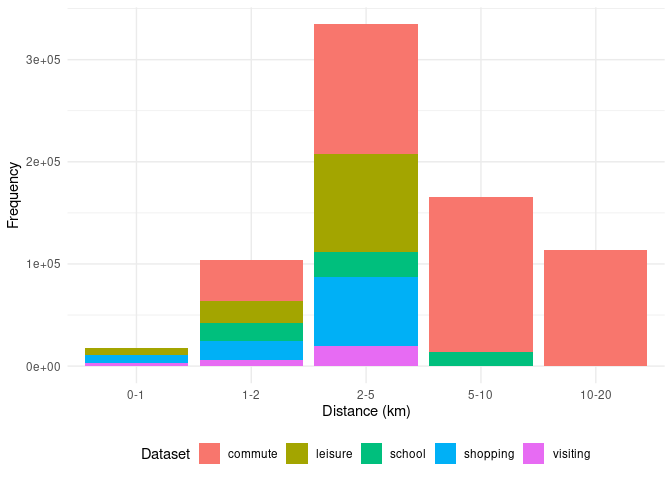
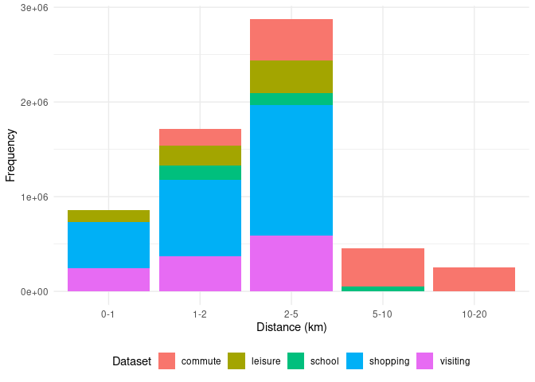

# Generating origin-destination data from first principles

# Introduction

The notes presented here are part of the quality assurance process for
the Network Planning Tool (NPT) project. They should also form the basis
of a more efficient data processing pipeline for the project.

# Current set-up

The OD datasets which form the basis of the NPT are presented below:

| dataset  |   nrow |   trips | mean_lenth | trips_per_row |
|:---------|-------:|--------:|-----------:|--------------:|
| commute  | 433259 | 1271788 |       7064 |             3 |
| school   |  55975 |  321955 |       3574 |             6 |
| shopping |  94474 | 2675530 |       2898 |            28 |
| visiting |  28538 | 1205857 |       2764 |            42 |
| leisure  | 124168 |  679334 |       3056 |             5 |

Their distance-frequency distributions are presented below:

     commute  leisure   school shopping visiting 
      433259   124168    55975    94474    28538 

In terms of number of trips:

# Proposed set-up

We should generate the desired number of trips and associated number of
OD pairs *per distance band* based on analysis of available datasets
before generating desire lines.

The information on the number of desired desire lines per distance band
can be used to sample from available desire lines generated by spatial
interaction models.

The spatial distribution of desire lines should also be explored before
routing.

The proportion of trips made by bike under the baseline scenario for
each origin zone should depend on the proportion of trips made by bike
according to official datasets.
