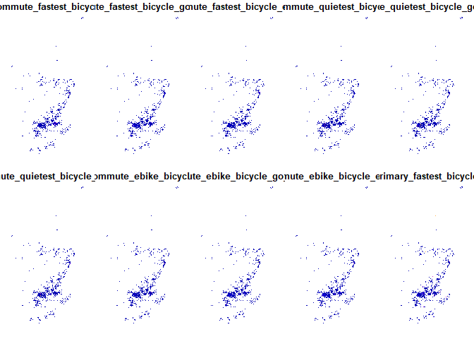
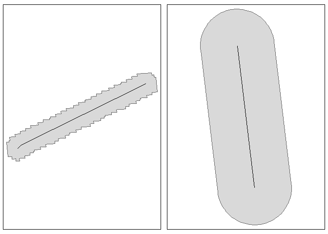

The aim of the code in here is to explore the combined_network object.

``` r
library(tidyverse)
```

    ── Attaching core tidyverse packages ──────────────────────── tidyverse 2.0.0 ──
    ✔ dplyr     1.1.3     ✔ readr     2.1.4
    ✔ forcats   1.0.0     ✔ stringr   1.5.0
    ✔ ggplot2   3.4.2     ✔ tibble    3.2.1
    ✔ lubridate 1.9.3     ✔ tidyr     1.3.0
    ✔ purrr     1.0.1     
    ── Conflicts ────────────────────────────────────────── tidyverse_conflicts() ──
    ✖ dplyr::filter() masks stats::filter()
    ✖ dplyr::lag()    masks stats::lag()
    ℹ Use the conflicted package (<http://conflicted.r-lib.org/>) to force all conflicts to become errors

``` r
library(sf)
```

    Linking to GEOS 3.11.2, GDAL 3.6.2, PROJ 9.2.0; sf_use_s2() is TRUE

``` r
library(targets)
setwd("~/../github/nptscot/npt")
tar_load(combined_network)
example_network = combined_network |> 
  sample_n(1000)
plot(example_network)
```

    Warning: plotting the first 10 out of 38 attributes; use max.plot = 38 to plot
    all



``` r
example_network_buffer = sf::st_buffer(sf::st_union(example_network), dist = 20, max_cells = 100000)
library(tmap)
```

    The legacy packages maptools, rgdal, and rgeos, underpinning the sp package,
    which was just loaded, will retire in October 2023.
    Please refer to R-spatial evolution reports for details, especially
    https://r-spatial.org/r/2023/05/15/evolution4.html.
    It may be desirable to make the sf package available;
    package maintainers should consider adding sf to Suggests:.
    The sp package is now running under evolution status 2
         (status 2 uses the sf package in place of rgdal)
    Breaking News: tmap 3.x is retiring. Please test v4, e.g. with
    remotes::install_github('r-tmap/tmap')

``` r
tmap_mode("plot")
```

    tmap mode set to plotting

``` r
example_network_polygons = sf::st_cast(example_network_buffer, "POLYGON")
m1 = qtm(example_network_polygons[1])

# Compare with projected buffer
net_projected = sf::st_transform(sf::st_union(example_network), "EPSG:27700")
example_network_buffer2 = sf::st_buffer(net_projected, dist = 20, max_cells = 100000)
example_network_polygons2 = sf::st_cast(example_network_buffer2, "POLYGON")
example_network1 = example_network[example_network_polygons, ]
m2 = qtm(example_network_polygons2[1])
tmap_arrange(m1 + qtm(example_network), m2 + qtm(net_projected))
```



``` r
# ttm()
# tmap_arrange(m1 + qtm(example_network), m2 + qtm(net_projected))
```
