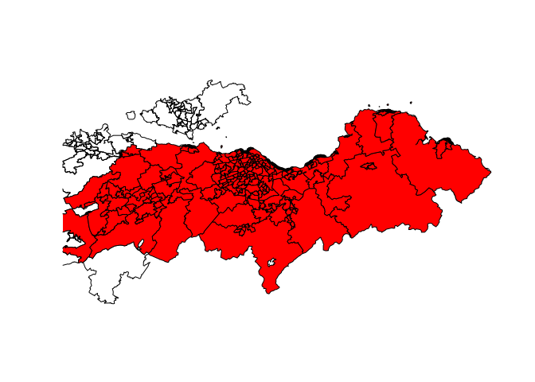

The code here is designed to debug the following target:

``` r
tar_target(od_shopping, {
  od_shopping = make_od_shopping(oas, os_pois, grid, trip_purposes,
                                intermediate_zones, parameters,region_boundary_buffered, odjitter_location = parameters$odjitter_location)
  od_shopping
}),
```

Which fails with the error:

    errored target od_shopping
    ✖ errored pipeline [16.653 seconds]
    Warning message:
    1 targets produced warnings. Run targets::tar_meta(fields = warnings, complete_only = TRUE) for the messages. 
    Error:
    ! Error running targets::tar_make()
    Error messages: targets::tar_meta(fields = error, complete_only = TRUE)
    Debugging guide: https://books.ropensci.org/targets/debugging.html
    How to ask for help: https://books.ropensci.org/targets/help.html
    Last error message:
        Cannot open "/tmp/RtmpCdX9jT/od_jittered.geojson"; The source could be corrupt or not supported. See `st_drivers()` for a list of supported formats.
    Last error traceback:
        make_od_shopping(oas, os_pois, grid, trip_purposes, intermediate_zones, ...
        odjitter::jitter(od = od_adjusted, zones = zones_shopping, zones_d = sho...
        sf::read_sf(output_path)
        st_read(..., quiet = quiet, stringsAsFactors = stringsAsFactors,      as...
        st_read.character(..., quiet = quiet, stringsAsFactors = stringsAsFactor...
        CPL_read_ogr(dsn, layer, query, as.character(options), quiet,      type,...
        stop(list("Cannot open \"/tmp/RtmpCdX9jT/od_jittered.geojson\"; The sour...
        (function (condition)  {     state$error <- build_message(condition)    ...

We can reproduce the state that led to the crash as follows:

``` r
library(sf)
```

    Linking to GEOS 3.12.1, GDAL 3.8.4, PROJ 9.3.1; sf_use_s2() is TRUE

``` r
library(tidyverse)
```

    ── Attaching core tidyverse packages ──────────────────────── tidyverse 2.0.0 ──
    ✔ dplyr     1.1.4     ✔ readr     2.1.5
    ✔ forcats   1.0.0     ✔ stringr   1.5.1
    ✔ ggplot2   3.5.1     ✔ tibble    3.2.1
    ✔ lubridate 1.9.3     ✔ tidyr     1.3.1
    ✔ purrr     1.0.2     

    ── Conflicts ────────────────────────────────────────── tidyverse_conflicts() ──
    ✖ purrr::%||%()   masks base::%||%()
    ✖ dplyr::filter() masks stats::filter()
    ✖ dplyr::lag()    masks stats::lag()
    ℹ Use the conflicted package (<http://conflicted.r-lib.org/>) to force all conflicts to become errors

``` r
library(targets)
```

``` r
if (!dir.exists("_targets")) {
  setwd("../..")
}
tar_source()
tar_load(parameters)
tar_load(oas)
tar_load(os_pois)
tar_load(grid)
tar_load(trip_purposes)
tar_load(intermediate_zones)
tar_load(region_boundary_buffered)
```

Let’s give it a go:

``` r
od_shopping = make_od_shopping(oas, os_pois, grid, trip_purposes,
                                intermediate_zones, parameters,region_boundary_buffered, odjitter_location = parameters$odjitter_location)
```

    Joining with `by = join_by(grid_id)`
    Maximum distance is > 100km. The 'cheap' measure is inaccurate over such large
    distances, you'd likely be better using a different 'measure'.
    20792 OD pairs remaining after removing those with a distance greater than 5000
    meters: 2% of all possible OD pairs

    Warning in CPL_read_ogr(dsn, layer, query, as.character(options), quiet, : GDAL
    Error 1: At line 2, character 1: Unterminated array

    Warning in CPL_read_ogr(dsn, layer, query, as.character(options), quiet, : GDAL
    Error 4: Failed to read GeoJSON data

    Error: Cannot open "/tmp/RtmpeMbxNy/od_jittered.geojson"; The source could be corrupt or not supported. See `st_drivers()` for a list of supported formats.

``` r
od_shopping
```

    Error in eval(expr, envir, enclos): object 'od_shopping' not found

Let’s step through the code in the function `make_od_shopping` to see
where the error is coming from.

``` r
make_od_shopping
function(oas, os_pois, grid, trip_purposes, intermediate_zones, parameters, study_area, odjitter_location = "odjitter"){
  
  os_retail = os_pois %>% 
    dplyr::filter(groupname == "Retail") # 26279 points
  os_retail = os_retail %>% 
    sf::st_transform(27700)
  
  shopping = os_retail %>% 
    dplyr::mutate(grid_id = sf::st_nearest_feature(os_retail, grid))
  
  # calculate weighting of each grid point
  shopping_grid = shopping %>% 
    sf::st_drop_geometry() %>% 
    dplyr::group_by(grid_id) %>% 
    dplyr::summarise(size = n())
  
  # assign grid geometry
  grid_df = data.frame(grid)
  grid_df = tibble::rowid_to_column(grid_df, "grid_id")
  shopping_join = dplyr::inner_join(grid_df, shopping_grid)
  shopping_grid = sf::st_as_sf(shopping_join)
  shopping_grid = sf::st_transform(shopping_grid, 4326)
  
  # Estimate number of shopping trips from each origin zone
  # Calculate number of trips / number of cyclists
  shop_percent = trip_purposes %>% 
    dplyr::filter(Purpose =="Shopping") %>% 
    dplyr::select(adjusted_mean)
  shop_percent = shop_percent[[1]]/100
  
  
  zones_shopping = intermediate_zones %>% 
    dplyr::select(InterZone, ResPop2011)
  # from NTS 2019 (England) average 953 trips/person/year divided by 365 = 2.61 trips/day
  zones_shopping = zones_shopping %>% 
    dplyr::mutate(shopping_trips = ResPop2011 * 2.61 * shop_percent) %>% 
    dplyr::select(-ResPop2011)
  zones_shopping = sf::st_transform(zones_shopping, 4326)
  zones_shopping = sf::st_make_valid(zones_shopping)
  
  # Spatial interaction model of journeys
  # We could validate this SIM using the Scottish data on mean km travelled 
  max_length_euclidean_km = 5
  od_shopping_initial = simodels::si_to_od(zones_shopping, shopping_grid, max_dist = max_length_euclidean_km * 1000)
  od_interaction = od_shopping_initial %>% 
    simodels::si_calculate(fun = gravity_model, 
                 m = origin_shopping_trips,
                 n = destination_size,
                 d = distance_euclidean,
                 beta = 0.5,
                 constraint_production = origin_shopping_trips)
  
  # Need to correct the number of trips, in accordance with origin_shopping_trips
  od_adjusted = od_interaction %>% 
    dplyr::group_by(O) %>% 
    dplyr::mutate(
      proportion = interaction / sum(interaction),
      shopping_all_modes = origin_shopping_trips * proportion
    ) %>% 
    dplyr::ungroup()    
  
  # Jittering
  shopping_polygons = sf::st_buffer(shopping_grid, dist = 0.0001)
    # Workaround for #445
  sf::st_geometry(shopping_polygons) = "geom"
  
  # why does distance_euclidean drop so dramatically when we go from od_interaction to od_adjusted_jittered? 
  od_adjusted_jittered = odjitter::jitter(
    od = od_adjusted,
    zones = zones_shopping,
    zones_d = shopping_polygons, # each polygon is a single grid point, so destinations are kept the same
    subpoints_origins = oas,
    subpoints_destinations = shopping_grid,
    disaggregation_key = "shopping_all_modes",
    disaggregation_threshold = parameters$disag_threshold,
    deduplicate_pairs = FALSE,
    odjitter_location = odjitter_location
  )
  
  # Get mode shares
  
  # These are the overall means from the SHS Travel Diaries in table 16 of 
  # transport-and-travel-in-scotland-2019-local-authority-tables.xlsx
  # car = driver + passenger
  # public_transport = bus + rail
  # taxi = taxi + other
  mode_shares = data_frame(
    bicycle = 0.012,
    foot = 0.221,
    car = 0.652,
    public_transport = 0.093,
    taxi = 0.022
  )
  
  od_shopping_jittered = od_adjusted_jittered %>% 
    dplyr::rename(
      geo_code1 = O,
      geo_code2 = D
    ) %>% 
    dplyr::mutate(bicycle = shopping_all_modes * mode_shares$bicycle,
           foot = shopping_all_modes * mode_shares$foot,
           car = shopping_all_modes * mode_shares$car,
           public_transport = shopping_all_modes * mode_shares$public_transport,
           taxi = shopping_all_modes * mode_shares$taxi
    )
  
  od_shopping_subset = od_shopping_jittered %>% 
    dplyr::rename(length_euclidean_unjittered = distance_euclidean) %>% 
    dplyr::mutate(
      length_euclidean_unjittered = length_euclidean_unjittered/1000,
      length_euclidean_jittered = units::drop_units(st_length(od_shopping_jittered))/1000
    ) %>%
    dplyr::filter(
      length_euclidean_jittered > (parameters$min_distance_meters/1000),
      length_euclidean_jittered < max_length_euclidean_km
    )
  n_short_lines_removed = nrow(od_shopping_jittered) - nrow(od_shopping_subset)
  message(n_short_lines_removed, " short or long desire lines removed")
  
  od_shopping_subset = od_shopping_subset %>% 
    dplyr::rename(
      origin_trips = origin_shopping_trips, 
      all = shopping_all_modes
    ) %>% 
    mutate(purpose = "shopping")
  
  od_shopping_subset
  
  
}
```

``` r
  os_retail = os_pois %>% 
    dplyr::filter(groupname == "Retail") # 26279 points
  os_retail = os_retail %>% 
    sf::st_transform(27700)
  
  shopping = os_retail %>% 
    dplyr::mutate(grid_id = sf::st_nearest_feature(os_retail, grid))
  
  # calculate weighting of each grid point
  shopping_grid = shopping %>% 
    sf::st_drop_geometry() %>% 
    dplyr::group_by(grid_id) %>% 
    dplyr::summarise(size = n())
  
  # assign grid geometry
  grid_df = data.frame(grid)
  grid_df = tibble::rowid_to_column(grid_df, "grid_id")
  shopping_join = dplyr::inner_join(grid_df, shopping_grid)
```

    Joining with `by = join_by(grid_id)`

``` r
  shopping_grid = sf::st_as_sf(shopping_join)
  shopping_grid = sf::st_transform(shopping_grid, 4326)
  
  # Estimate number of shopping trips from each origin zone
  # Calculate number of trips / number of cyclists
  shop_percent = trip_purposes %>% 
    dplyr::filter(Purpose =="Shopping") %>% 
    dplyr::select(adjusted_mean)
  shop_percent = shop_percent[[1]]/100
  
  
  zones_shopping = intermediate_zones %>% 
    dplyr::select(InterZone, ResPop2011)
  # from NTS 2019 (England) average 953 trips/person/year divided by 365 = 2.61 trips/day
  zones_shopping = zones_shopping %>% 
    dplyr::mutate(shopping_trips = ResPop2011 * 2.61 * shop_percent) %>% 
    dplyr::select(-ResPop2011)
  zones_shopping = sf::st_transform(zones_shopping, 4326)
  zones_shopping = sf::st_make_valid(zones_shopping)
  
  # Spatial interaction model of journeys
  # We could validate this SIM using the Scottish data on mean km travelled 
  max_length_euclidean_km = 5
  od_shopping_initial = simodels::si_to_od(zones_shopping, shopping_grid, max_dist = max_length_euclidean_km * 1000)
```

    Maximum distance is > 100km. The 'cheap' measure is inaccurate over such
    large distances, you'd likely be better using a different 'measure'.
    20792 OD pairs remaining after removing those with a distance greater than 5000 meters:
    2% of all possible OD pairs

``` r
  od_interaction = od_shopping_initial %>% 
    simodels::si_calculate(fun = gravity_model, 
                 m = origin_shopping_trips,
                 n = destination_size,
                 d = distance_euclidean,
                 beta = 0.5,
                 constraint_production = origin_shopping_trips)
  
  # Need to correct the number of trips, in accordance with origin_shopping_trips
  od_adjusted = od_interaction %>% 
    dplyr::group_by(O) %>% 
    dplyr::mutate(
      proportion = interaction / sum(interaction),
      shopping_all_modes = origin_shopping_trips * proportion
    ) %>% 
    dplyr::ungroup()    
  
  # Jittering
  shopping_polygons = sf::st_buffer(shopping_grid, dist = 0.0001)
    # Workaround for #445
  sf::st_geometry(shopping_polygons) = "geom"
```

And the jittering command is:

``` r
  od_adjusted_jittered = odjitter::jitter(
    od = od_adjusted,
    zones = zones_shopping,
    zones_d = shopping_polygons, # each polygon is a single grid point, so destinations are kept the same
    subpoints_origins = oas,
    subpoints_destinations = shopping_grid,
    disaggregation_key = "shopping_all_modes",
    disaggregation_threshold = parameters$disag_threshold,
    deduplicate_pairs = FALSE
  )
```

    Warning in CPL_read_ogr(dsn, layer, query, as.character(options), quiet, : GDAL
    Error 1: At line 2, character 1: Unterminated array

    Warning in CPL_read_ogr(dsn, layer, query, as.character(options), quiet, : GDAL
    Error 4: Failed to read GeoJSON data

    Error: Cannot open "/tmp/RtmpeMbxNy/od_jittered.geojson"; The source could be corrupt or not supported. See `st_drivers()` for a list of supported formats.

From that the error was found:

    Error: No subpoints for zone jitterS02002357

Let’s take a look at the zone codes:

``` r
head(zones_shopping$InterZone)
```

    [1] "S02001236" "S02001237" "S02001238" "S02001239" "S02001240" "S02001241"

As a test, let’s try to jitter a subset of the data:

``` r
zones_1_3 = zones_shopping |>
  filter(InterZone %in% c(od_adjusted$O, od_adjusted$D)) |>
  slice(1:3)
od_adjusted_z_1_3 = od_adjusted |>
  filter(O %in% zones_1_3$InterZone) 
#   |>
#   filter(D %in% zones_1_3$InterZone
# Try again:
od_adjusted_jittered = odjitter::jitter(
  od = od_adjusted_z_1_3,
  zones = zones_1_3,
  zones_d = shopping_polygons, # each polygon is a single grid point, so destinations are kept the same
  subpoints_origins = oas,
  subpoints_destinations = shopping_grid,
  disaggregation_key = "shopping_all_modes",
  disaggregation_threshold = parameters$disag_threshold,
  deduplicate_pairs = FALSE
)
```

That demostrates the issue: it’s edge cases were zones lack subpoints.
The solution is add subpoints to the zones that lack them.

``` r
zones_with_od = zones_shopping |>
  filter(InterZone %in% od_adjusted$O | InterZone %in% od_adjusted$D)
zones_with_subpoints = zones_with_od[oas, ]
zones_without_subpoints = zones_with_od |>
    filter(!InterZone %in% zones_with_subpoints$InterZone)
```

``` r
plot(sf::st_geometry(oas))
plot(sf::st_geometry(zones_without_subpoints), add = TRUE)
plot(sf::st_geometry(zones_with_subpoints), add = TRUE, col = "red")
```


