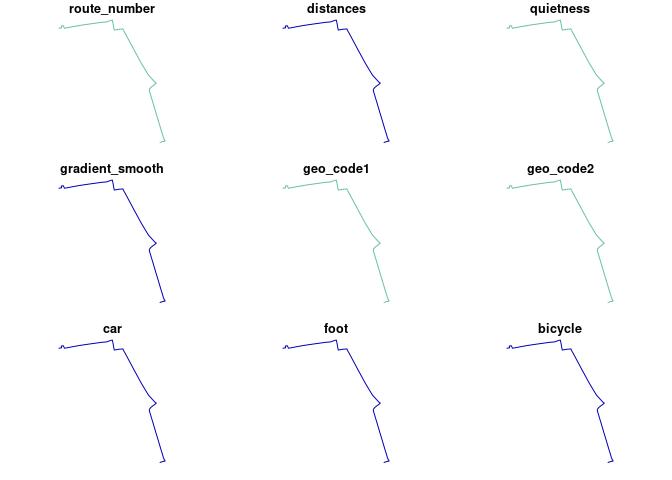

``` r
library(sf)
```

    Linking to GEOS 3.12.1, GDAL 3.8.4, PROJ 9.3.1; sf_use_s2() is TRUE

``` r
library(tidyverse)
```

    ── Attaching core tidyverse packages ──────────────────────── tidyverse 2.0.0 ──
    ✔ dplyr     1.1.4     ✔ readr     2.1.5
    ✔ forcats   1.0.0     ✔ stringr   1.5.1
    ✔ ggplot2   3.5.1     ✔ tibble    3.2.1
    ✔ lubridate 1.9.3     ✔ tidyr     1.3.1
    ✔ purrr     1.0.2     

    ── Conflicts ────────────────────────────────────────── tidyverse_conflicts() ──
    ✖ purrr::%||%()   masks base::%||%()
    ✖ dplyr::filter() masks stats::filter()
    ✖ dplyr::lag()    masks stats::lag()
    ℹ Use the conflicted package (<http://conflicted.r-lib.org/>) to force all conflicts to become errors

``` r
library(targets)
```

``` r
setwd("../..")
tar_load(parameters)
tar_load(uptake_utility_fastest)
tar_load(uptake_commute_fastest)
names(uptake_utility_fastest)
```

     [1] "route_number"              "distances"                
     [3] "quietness"                 "gradient_smooth"          
     [5] "geo_code1"                 "geo_code2"                
     [7] "car"                       "foot"                     
     [9] "bicycle"                   "all"                      
    [11] "dist_euclidean"            "public_transport"         
    [13] "taxi"                      "dist_euclidean_jittered"  
    [15] "purpose"                   "endDZ"                    
    [17] "startDZ"                   "geometry"                 
    [19] "route_hilliness"           "length_route"             
    [21] "pcycle_go_dutch"           "pcycle_ebike"             
    [23] "bicycle_go_dutch"          "bicycle_ebike"            
    [25] "mode_ratio_baseline"       "mode_ratio_go_dutch"      
    [27] "mode_ratio_ebike"          "car_go_dutch"             
    [29] "public_transport_go_dutch" "foot_go_dutch"            
    [31] "taxi_go_dutch"             "car_ebike"                
    [33] "public_transport_ebike"    "foot_ebike"               
    [35] "taxi_ebike"               

``` r
#  [1] "route_number"              "distances"                
#  [3] "quietness"                 "gradient_smooth"          
#  [5] "geo_code1"                 "geo_code2"                
#  [7] "car"                       "foot"                     
#  [9] "bicycle"                   "all"                      
# [11] "dist_euclidean"            "public_transport"         
# [13] "taxi"                      "dist_euclidean_jittered"  
# [15] "purpose"                   "endDZ"                    
# [17] "startDZ"                   "geometry"                 
# [19] "route_hilliness"           "length_route"             
# [21] "pcycle_go_dutch"           "pcycle_ebike"             
# [23] "bicycle_go_dutch"          "bicycle_ebike"            
# [25] "mode_ratio_baseline"       "mode_ratio_go_dutch"      
# [27] "mode_ratio_ebike"          "car_go_dutch"             
# [29] "public_transport_go_dutch" "foot_go_dutch"            
# [31] "taxi_go_dutch"             "car_ebike"                
# [33] "public_transport_ebike"    "foot_ebike"               
# [35] "taxi_ebike"   
head(uptake_utility_fastest)
```

    Simple feature collection with 6 features and 34 fields
    Geometry type: LINESTRING
    Dimension:     XY
    Bounding box:  xmin: -4.18703 ymin: 55.75881 xmax: -4.16931 ymax: 55.76907
    Geodetic CRS:  WGS 84
    # A tibble: 6 × 35
    # Groups:   route_number [6]
      route_number distances quietness gradient_smooth geo_code1 geo_code2   car
      <chr>            <dbl> <chr>               <dbl> <chr>     <chr>     <dbl>
    1 1                 2046 32                0.00831 S02002422 65013      65.6
    2 2                 1425 28                0.0119  S02002422 65013      65.6
    3 3                 1502 29                0.0120  S02002422 65013      65.6
    4 4                 1540 27                0.0110  S02002422 65013      65.6
    5 5                 1604 31                0.0106  S02002422 65013      65.6
    6 6                 1565 30                0.0102  S02002422 65013      65.6
    # ℹ 28 more variables: foot <dbl>, bicycle <dbl>, all <dbl>,
    #   dist_euclidean <dbl>, public_transport <dbl>, taxi <dbl>,
    #   dist_euclidean_jittered <dbl>, purpose <chr>, endDZ <chr>, startDZ <chr>,
    #   geometry <LINESTRING [°]>, route_hilliness <dbl>, length_route <dbl>,
    #   pcycle_go_dutch <dbl>, pcycle_ebike <dbl>, bicycle_go_dutch <dbl>,
    #   bicycle_ebike <dbl>, mode_ratio_baseline <dbl>, mode_ratio_go_dutch <dbl>,
    #   mode_ratio_ebike <dbl>, car_go_dutch <dbl>, …

``` r
edinburgh = zonebuilder::zb_zone("edinburgh")
```

    Loading required namespace: tmaptools

``` r
edinburgh_1km = edinburgh |>
  slice(1)
uptake_sample = uptake_utility_fastest[edinburgh_1km,]
uptake_sample |>
  select(1) |>
  plot()
```


``` r
uptake_1 = uptake_sample |>
  ungroup() |>
  slice(1)
plot(uptake_1)
```

    Warning: plotting the first 9 out of 34 attributes; use max.plot = 34 to plot
    all



``` r
sf::st_length(uptake_1)
```

    3690.236 [m]

``` r
summary(sf::st_length(uptake_sample))
```

       Min. 1st Qu.  Median    Mean 3rd Qu.    Max. 
      651.6  3245.7  4350.3  4195.9  5286.1  7893.4 

``` r
# for all utility routes:
uptake_utility_fastest |>
  st_length() |>
  summary()
```

       Min. 1st Qu.  Median    Mean 3rd Qu.    Max. 
      438.4  2736.8  4148.1  4073.0  5365.3 10008.4 

``` r
pcycle_utility = pct::uptake_pct_godutch_2020(
    distance = sf::st_length(uptake_utility_fastest) |> as.numeric(),
    gradient = uptake_utility_fastest$route_hilliness
)
summary(pcycle_utility)
```

       Min. 1st Qu.  Median    Mean 3rd Qu.    Max. 
    0.01483 0.35382 0.40619 0.40013 0.45353 0.55865 

Same for all commutes:

``` r
uptake_commute_fastest |>
  st_length() |>
  summary()
```

       Min. 1st Qu.  Median    Mean 3rd Qu.    Max. 
       1020    4633    8168    9006   12747   82859 

``` r
pcycle_commute = pct::uptake_pct_godutch_2020(
    distance = sf::st_length(uptake_commute_fastest) |> as.numeric(),
    gradient = uptake_commute_fastest$route_hilliness
)
summary(pcycle_commute)
```

       Min. 1st Qu.  Median    Mean 3rd Qu.    Max. 
    0.01229 0.11610 0.25601 0.25650 0.38838 0.55861 
