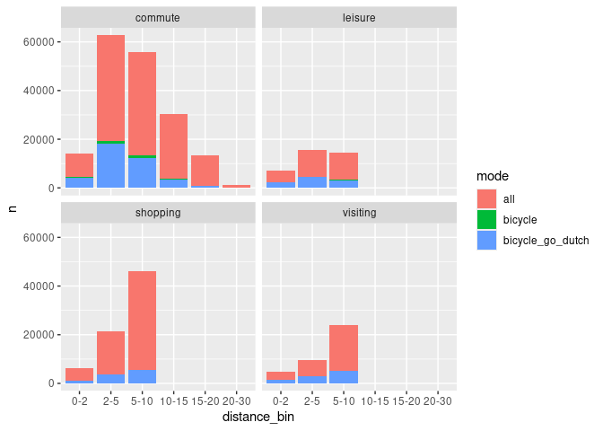

``` r
library(sf)
```

    Linking to GEOS 3.12.1, GDAL 3.8.4, PROJ 9.3.1; sf_use_s2() is TRUE

``` r
library(tidyverse)
```

    ── Attaching core tidyverse packages ──────────────────────── tidyverse 2.0.0 ──
    ✔ dplyr     1.1.4     ✔ readr     2.1.5
    ✔ forcats   1.0.0     ✔ stringr   1.5.1
    ✔ ggplot2   3.5.1     ✔ tibble    3.2.1
    ✔ lubridate 1.9.3     ✔ tidyr     1.3.1
    ✔ purrr     1.0.2     

    ── Conflicts ────────────────────────────────────────── tidyverse_conflicts() ──
    ✖ purrr::%||%()   masks base::%||%()
    ✖ dplyr::filter() masks stats::filter()
    ✖ dplyr::lag()    masks stats::lag()
    ℹ Use the conflicted package (<http://conflicted.r-lib.org/>) to force all conflicts to become errors

``` r
library(targets)
```

``` r
if (!dir.exists("_targets")) {
  setwd("../..")
}
tar_load(parameters)
tar_load(uptake_utility_fastest)
tar_load(uptake_commute_fastest)
# names(uptake_utility_fastest)
#  [1] "route_number"              "distances"                
#  [3] "quietness"                 "gradient_smooth"          
#  [5] "geo_code1"                 "geo_code2"                
#  [7] "car"                       "foot"                     
#  [9] "bicycle"                   "all"                      
# [11] "dist_euclidean"            "public_transport"         
# [13] "taxi"                      "dist_euclidean_jittered"  
# [15] "purpose"                   "endDZ"                    
# [17] "startDZ"                   "geometry"                 
# [19] "route_hilliness"           "length_route"             
# [21] "pcycle_go_dutch"           "pcycle_ebike"             
# [23] "bicycle_go_dutch"          "bicycle_ebike"            
# [25] "mode_ratio_baseline"       "mode_ratio_go_dutch"      
# [27] "mode_ratio_ebike"          "car_go_dutch"             
# [29] "public_transport_go_dutch" "foot_go_dutch"            
# [31] "taxi_go_dutch"             "car_ebike"                
# [33] "public_transport_ebike"    "foot_ebike"               
# [35] "taxi_ebike"   
head(uptake_utility_fastest)
```

    Simple feature collection with 6 features and 34 fields
    Geometry type: LINESTRING
    Dimension:     XY
    Bounding box:  xmin: -4.18703 ymin: 55.75881 xmax: -4.16931 ymax: 55.76907
    Geodetic CRS:  WGS 84
    # A tibble: 6 × 35
    # Groups:   route_number [6]
      route_number distances quietness gradient_smooth geo_code1 geo_code2   car
      <chr>            <dbl> <chr>               <dbl> <chr>     <chr>     <dbl>
    1 1                 2046 32                0.00831 S02002422 65013      65.6
    2 2                 1425 28                0.0119  S02002422 65013      65.6
    3 3                 1502 29                0.0120  S02002422 65013      65.6
    4 4                 1540 27                0.0110  S02002422 65013      65.6
    5 5                 1604 31                0.0106  S02002422 65013      65.6
    6 6                 1565 30                0.0102  S02002422 65013      65.6
    # ℹ 28 more variables: foot <dbl>, bicycle <dbl>, all <dbl>,
    #   dist_euclidean <dbl>, public_transport <dbl>, taxi <dbl>,
    #   dist_euclidean_jittered <dbl>, purpose <chr>, endDZ <chr>, startDZ <chr>,
    #   geometry <LINESTRING [°]>, route_hilliness <dbl>, length_route <dbl>,
    #   pcycle_go_dutch <dbl>, pcycle_ebike <dbl>, bicycle_go_dutch <dbl>,
    #   bicycle_ebike <dbl>, mode_ratio_baseline <dbl>, mode_ratio_go_dutch <dbl>,
    #   mode_ratio_ebike <dbl>, car_go_dutch <dbl>, …

Let’s start by exploring the number of cycling trips in utility and
commuting trips:

``` r
sum(uptake_utility_fastest$all) /
sum(uptake_commute_fastest$all)
```

    [1] 3.671363

Let’s look at the numbers by distance:

``` r
uptake_combined = bind_rows(
    uptake_utility_fastest |>
        sf::st_drop_geometry() |>
        transmute(
            purpose,
            all,
            bicycle,
            bicycle_go_dutch,
            length_route,
            route_hilliness
            ),
    uptake_commute_fastest |>
        sf::st_drop_geometry() |>
        transmute(
            purpose = "commute",
            all,
            bicycle,
            bicycle_go_dutch,
            length_route,
            route_hilliness
            )
)
distance_bins = c(0, 2, 5, 10, 15, 20, 30)
distance_bin_labels = c("0-2", "2-5", "5-10", "10-15", "15-20", "20-30")
uptake_combined = uptake_combined |>
    mutate(
        distance_bin = cut(length_route, distance_bins * 1000, labels = distance_bin_labels, right = FALSE)
    ) |>
  # pivot longer to get n trips by mode and purpose
  pivot_longer(
    cols = c(all, bicycle, bicycle_go_dutch),
    names_to = "mode",
    values_to = "n"
  ) 
# Barplot with n trips by mode and purpose:
uptake_combined |>
    # count by distance bin, mode and purpose
    group_by(distance_bin, mode, purpose) |>
    summarise(n = sum(n)) |>
    # plot
    ggplot(aes(x = distance_bin, y = n, fill = mode)) +
    geom_bar(stat = "identity") +
    facet_wrap(~purpose)
```

    `summarise()` has grouped output by 'distance_bin', 'mode'. You can override
    using the `.groups` argument.



The same data can be presented as a table:

``` r
uptake_combined |>
    # # Only bicycle and bicycle_go_dutch
    # filter(mode %in% c("bicycle", "bicycle_go_dutch")) |>
    group_by(purpose, mode) |>
    summarise(n = sum(n)) |>
    pivot_wider(names_from = mode, values_from = n) |>
    mutate(
      go_dutch_ratio = bicycle_go_dutch / bicycle,
      perc_bicycle = bicycle / all * 100,
      perc_bicycle_go_dutch = bicycle_go_dutch / all * 100
    ) |>
    knitr::kable(digits = 0)
```

    `summarise()` has grouped output by 'purpose'. You can override using the
    `.groups` argument.

| purpose  |     all | bicycle | bicycle_go_dutch | go_dutch_ratio | perc_bicycle | perc_bicycle_go_dutch |
|:---------|--------:|--------:|-----------------:|---------------:|-------------:|----------------------:|
| commute  | 1236922 |   26172 |           360281 |             14 |            2 |                    29 |
| leisure  |  675697 |    8108 |           275562 |             34 |            1 |                    41 |
| shopping | 2663263 |   15980 |           546561 |             34 |            1 |                    21 |
| visiting | 1202229 |   14427 |           492750 |             34 |            1 |                    41 |

The numbers presented don’t represent the percent of *total* trips
cycled but the percent of trips *of the trips included in the OD data*.

Estimates of the number of trips cycled for different modes, based on
2024 [mid year estimates from the England National Travel
Survey](https://www.gov.uk/government/statistical-data-sets/national-travel-survey-mid-year-estimates),
are as follows, in units of average number of trips per person per year:

    Skipping install of 'readODS' from a cran remote, the SHA1 (2.2.0) has not changed since last install.
      Use `force = TRUE` to force installation

|          | cycling |   all | percent_cycling |
|:---------|--------:|------:|----------------:|
| commute  |     5.0 | 118.9 |             4.2 |
| shop     |     1.6 | 165.4 |             0.9 |
| personal |     0.9 |  73.1 |             1.2 |
| leisure  |     5.8 | 228.4 |             2.5 |

Multiplying these numbers by the population of Scotland (5.4m) and
dividing by 365, we get the following estimates for the number of trips
cycled in Scotland in 2024:

``` r
pop_scotland = 5.4e6
nts_summary_scotland = nts_summary_wide |>
  mutate(across(cycling:all, ~ . * pop_scotland / 365)) |>
  select(all, cycling) 
nts_summary_scotland |>
  knitr::kable(digits = 0)
```

|          |     all | cycling |
|:---------|--------:|--------:|
| commute  | 1759363 |   74324 |
| shop     | 2447636 |   23030 |
| personal | 1081343 |   12922 |
| leisure  | 3379664 |   85096 |

The equivalent table from the uptake data is:

``` r
uptake_summary = uptake_combined |>
    # Only all and bicycle
    filter(mode %in% c("all", "bicycle")) |>
    group_by(purpose, mode) |>
    summarise(n = sum(n)) |>
    pivot_wider(names_from = mode, values_from = n) |>
    select(all = all, cycling = bicycle)
```

    `summarise()` has grouped output by 'purpose'. You can override using the
    `.groups` argument.
    Adding missing grouping variables: `purpose`

``` r
uptake_summary |>
    knitr::kable(digits = 0)
```

| purpose  |     all | cycling |
|:---------|--------:|--------:|
| commute  | 1236922 |   26172 |
| leisure  |  675697 |    8108 |
| shopping | 2663263 |   15980 |
| visiting | 1202229 |   14427 |

We can compare these two sets of results graphically as follows:

    Joining with `by = join_by(purpose, mode)`


# Geo

``` r
edinburgh = zonebuilder::zb_zone("edinburgh")
```

    Loading required namespace: tmaptools

``` r
edinburgh_1km = edinburgh |>
  slice(1)
uptake_sample = uptake_utility_fastest[edinburgh_1km,]
uptake_sample |>
  select(1) |>
  plot()
```


``` r
uptake_1 = uptake_sample |>
  ungroup() |>
  slice(1)
plot(uptake_1)
```

    Warning: plotting the first 9 out of 34 attributes; use max.plot = 34 to plot
    all


``` r
sf::st_length(uptake_1)
```

    3690.236 [m]

``` r
summary(sf::st_length(uptake_sample))
```

       Min. 1st Qu.  Median    Mean 3rd Qu.    Max. 
      651.6  3245.7  4350.3  4195.9  5286.1  7893.4 

``` r
# for all utility routes:
uptake_utility_fastest |>
  st_length() |>
  summary()
```

       Min. 1st Qu.  Median    Mean 3rd Qu.    Max. 
      438.4  2736.8  4148.1  4073.0  5365.3 10008.4 

``` r
pcycle_utility = pct::uptake_pct_godutch_2020(
    distance = sf::st_length(uptake_utility_fastest) |> as.numeric(),
    gradient = uptake_utility_fastest$route_hilliness
)
summary(pcycle_utility)
```

       Min. 1st Qu.  Median    Mean 3rd Qu.    Max. 
    0.01483 0.35382 0.40619 0.40013 0.45353 0.55865 

``` r
mean(pcycle_utility)
```

    [1] 0.4001263

``` r
mean(uptake_utility_fastest$pcycle_go_dutch) # supressed due to shopping
```

    [1] 0.3229911

Same for all commutes:

``` r
uptake_commute_fastest |>
  st_length() |>
  summary()
```

       Min. 1st Qu.  Median    Mean 3rd Qu.    Max. 
       1020    4633    8168    9006   12747   82859 

``` r
pcycle_commute = pct::uptake_pct_godutch_2020(
    distance = sf::st_length(uptake_commute_fastest) |> as.numeric(),
    gradient = uptake_commute_fastest$route_hilliness
)
summary(pcycle_commute)
```

       Min. 1st Qu.  Median    Mean 3rd Qu.    Max. 
    0.01229 0.11610 0.25601 0.25650 0.38838 0.55861 

``` r
mean(pcycle_commute)
```

    [1] 0.2565037

``` r
mean(uptake_commute_fastest$pcycle_go_dutch) 
```

    [1] 0.2565333

Exploring current % cycling:

``` r
uptake_combined = bind_rows(
    uptake_utility_fastest |>
        sf::st_drop_geometry() |>
        transmute(
            route_type = "utility",
            pcycle_go_dutch,
            length_route,
            route_hilliness
            ),
    uptake_commute_fastest |>
        sf::st_drop_geometry() |>
        transmute(
            route_type = "commute",
            pcycle_go_dutch,
            length_route,
            route_hilliness
            )
)
# Plot length vs % cycling
uptake_combined |>
    ggplot(aes(x = length_route, y = pcycle_go_dutch, color = route_type)) +
    geom_point(alpha = 0.01) +
    geom_smooth() +
    xlim(0, 10000)
```

    `geom_smooth()` using method = 'gam' and formula = 'y ~ s(x, bs = "cs")'

    Warning: Removed 169541 rows containing non-finite outside the scale range
    (`stat_smooth()`).

    Warning: Removed 169541 rows containing missing values or values outside the scale range
    (`geom_point()`).


The above plot shows that the uptake model is working correctly for
utility trips, with cycling potential slightly below cycling potential
for commute trips, for OD pairs with equivalent lengths and distances.

Let’s look at the distribution of trip lengths:

``` r
uptake_combined |>
    ggplot(aes(x = length_route, fill = route_type)) +
    geom_histogram(bins = 100) +
    xlim(0, 20000)
```

    Warning: Removed 7682 rows containing non-finite outside the scale range
    (`stat_bin()`).

    Warning: Removed 4 rows containing missing values or values outside the scale range
    (`geom_bar()`).


This shows that utility trips are much shorter than commute trips. The
average commute trip is 9005 meters long, while the average utility trip
is 4072 meters long.
