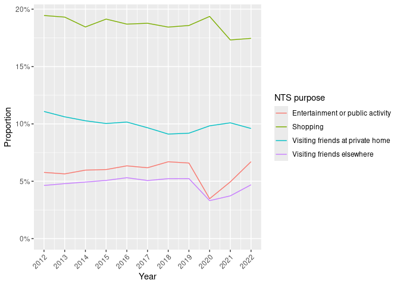
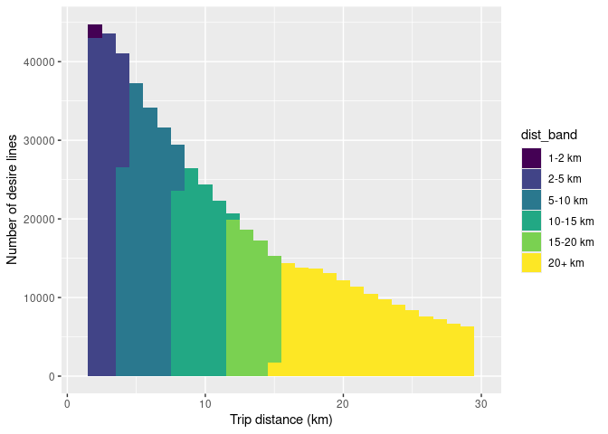
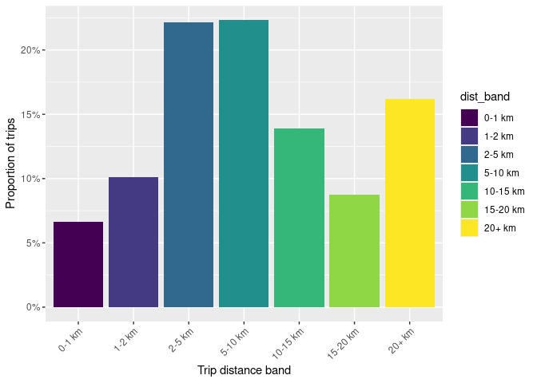
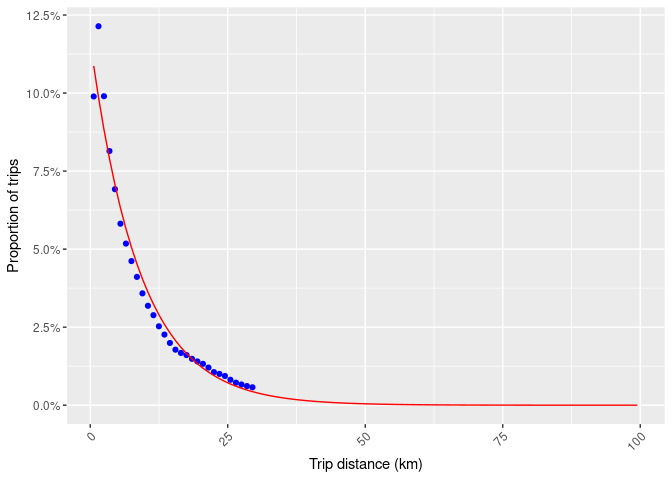
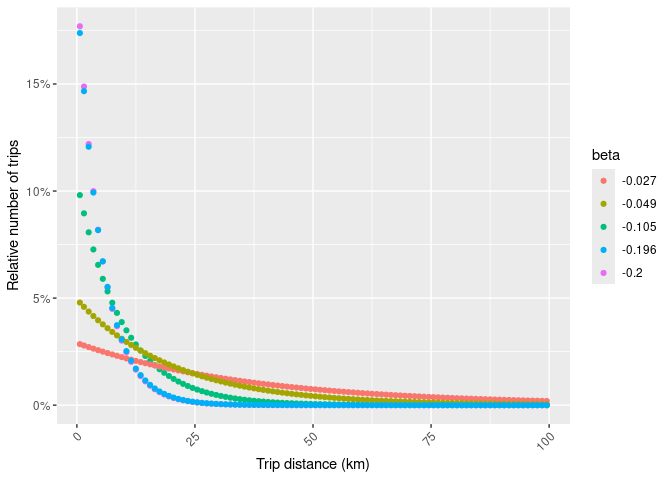
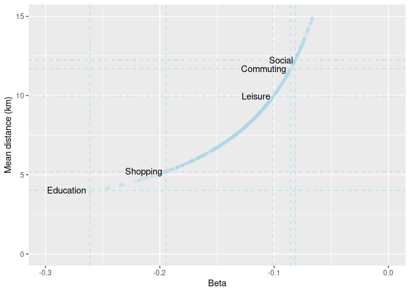
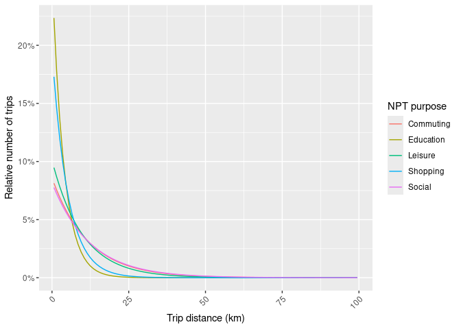

# Utility trips methodology
Joey Talbot and Robin Lovelace
2024-05-18

## Trip numbers and purposes

We estimated trips for three everyday purposes (in addition to commuting
and travel to school):

- shopping
- social (visiting friends and family)
- leisure

These are presented in a single network layer under the joint category
of ‘Other Everyday’ trips.

We used data from England’s National Travel Survey 2019 to estimate the
total number of trips undertaken per person per day, as AADT. This gives
an average of 953 trips per person per year, which equates to 2.61 trips
per person per day. A trip is defined as a one-way course of travel from
one place to another
(https://www.gov.uk/government/statistics/national-travel-survey-2022-technical-report/national-travel-survey-2022-technical-report-glossary#trip).

Data on the number of trips per person per year is not available for
Scotland after 2012 as far as we can tell. The Scottish Household Survey
only records travel on the day before the survey. The National Travel
Survey records travel patterns over an entire week. However, for the ten
year period from 2002/03 to 2011/12, the National Travel Survey recorded
a mean of 995 trips per person per year by Scottish residents. In
England, during 2002 to 2012, there were 1023 trips per person per year
(https://assets.publishing.service.gov.uk/media/64e8b00063587000141dbfa6/nts0303.ods)

We assigned daily trips to trip purposes using the trip purpose
percentage breakdown from the Scottish Household Survey, Table TD3 of
the Transport and Travel in Scotland 2019 travel diary tables (after
adjusting these percentages to remove the ‘Go Home’ category). This
results in 25.1% of trips being assigned for shopping, 11.7% for social,
and 6.3% for leisure, compared with 23.3% for commuting
(https://www.transport.gov.scot/media/51346/transport-and-travel-in-scotland-2019-travel-diary-tables.xlsx).

The roughly equivalent purposes in the National Travel Survey for 2022
are as follows:

| NTS purpose                      | Proportion | NPT purpose |
|:---------------------------------|:-----------|:------------|
| Shopping                         | 17.5%      | Shopping    |
| Visiting friends at private home | 9.6%       | Social      |
| Visiting friends elsewhere       | 4.7%       | Social      |
| Entertainment or public activity | 6.7%       | Leisure     |

Aggregating the NTS purposes to match the NPT purposes, we find that the
mode split for the three everyday purposes in 2022 is as follows:

| NPT purpose | Proportion (NTS) | Proportion (NPT) |
|:------------|:-----------------|:-----------------|
| Leisure     | 6.7%             | 6.3%             |
| Shopping    | 17.5%            | 25.1%            |
| Social      | 14.3%            | 11.7%            |

The evolution of overall mode split from 2012 to 2022 in England is
shown below:

## Trip distances by purpose

Data on the distribution of trip distances (what % of trips are 0-2, 2-5
km etc) is important for the uptake model. We took data from the
National Travel Survey, shown below, as the basis of average trip
lengths for the three everyday purposes, as shown in the table below.

| NPT purpose | Average length (miles) | Av (km) | Average length (relative to commuting) |
|:------------|-----------------------:|--------:|---------------------------------------:|
| Commuting   |                   8.47 |   13.64 |                                   1.00 |
| Education   |                   2.91 |    4.68 |                                   0.34 |
| Leisure     |                   7.22 |   11.62 |                                   0.85 |
| Shopping    |                   3.77 |    6.07 |                                   0.44 |
| Social      |                   8.86 |   14.27 |                                   1.05 |

Lengths are expressed relative to the average commuting trip, the trip
purpose for which we have the best data, allowing us to more effectively
model trip distance distributions in different places (rural areas will
tend to have longer trips for all trip purposes, for example), and
allowing for the fact that absolute trip lengths vary. Note: the
assumption that the relative trip lengths are the same in Scotland as in
England is a simplification and can be tested when more detailed data is
available.

### Trip distance bands

Trip distance distributions by purpose are not available in open
summaries of the Scottish Household Survey or National Travel Survey
that we have seen. We therefore use trip distance-frequency
distributions for known commuting trips in Scotland, and adjust them
based on the relative average trip lengths for the other purposes
outlined above, to ensure realistic trip distance distributions for the
other purposes.

The approach is illustrated in the graphs of trip distance distributions
below:

We will model the number of trips as a function of distance using
exponential decay, with the following functional form:

$$
N = \alpha \exp(d \beta)
$$

where $N$ is the number of trips, $d$ is the distance, and $\alpha$ and
$\beta$ are parameters to be estimated.

Taking the log of both sides gives:

$$
\log(N) = \log(\alpha) + d \beta
$$

This allows us to model the number of trips as a linear function of
distance, to estimate the decay parameter $\alpha$. As shown in the
graph below, this approach fits the data well (note: the observed
commute data only goes to 30 km as this was the cutoff used when
processing the raw origin-destination data and converting to geographic
desire lines from which distances can be calculated):

The value of $log(\alpha)$ and $\beta$ for Euclidean distances (used as
the basis of the spatial interaction model) are estimated as follows:

         (Intercept) average_distance 
           -2.148291        -0.111557 

Knowing the relative average trip lengths for the three everyday
purposes, we can adjust the decay parameter $\beta$ to reflect the
different trip lengths for the different purposes. The modelled and
empirical mean distances implied from the Scottish commute data above
are shown in the table below:

| NPT purpose                       | Average distance (km) | %1-2  | %2-5  |
|:----------------------------------|----------------------:|:------|:------|
| Commuting (observed, up to 30km)  |                 10.78 | 12.1% | 18.0% |
| Commuting (modelled, up to 100km) |                 11.70 | 9.9%  | 16.7% |

We fitted $\beta$ parameters to ensure that the relative average trip
lengths matched the relative average trip lengths for the three everyday
purposes. Summary visualisations of the fitting process are shown below.

Target average trip lengths, and associated $\beta$ values, are shown in
the table below:

| NPT purpose | Average length (relative to commuting) | Average route distance km |   beta |
|:------------|---------------------------------------:|--------------------------:|-------:|
| Commuting   |                                  1.000 |                     11.70 | -0.086 |
| Education   |                                  0.343 |                      4.02 | -0.261 |
| Leisure     |                                  0.852 |                      9.97 | -0.101 |
| Shopping    |                                  0.445 |                      5.20 | -0.195 |
| Social      |                                  1.046 |                     12.23 | -0.082 |

The resulting trip distance distributions for the three everyday
purposes are shown in the graph below:

The approach allows us to estimate the proportion and overall number of
trips in every distance band of arbitrary width for each purpose. For
the purposes of this study and to ensure the results are straightforward
to interpret, we will use the same 0-1, 1-2, 2-5, 5-10, 10-15, 15-20,
and 20+ km distance bands as used in the commute model, with 0-1 and 20+
km bands omitted from the routing and uptake model as they are deemed
too short and too long to cycle, respectively.

The results are summarised in the table below:

| NPT purpose | 0-1 km | 1-2 km | 2-5 km | 5-10 km | 10-15 km | 15-20 km | 20+ km | Total |
|:------------|-------:|-------:|-------:|--------:|---------:|---------:|-------:|------:|
| Commuting   |   8.13 |   7.55 |  13.29 |   20.64 |    14.64 |     8.12 |  27.63 |   100 |
| Education   |  22.35 |  17.82 |  24.33 |   23.02 |     8.09 |     2.39 |   2.00 |   100 |
| Leisure     |   9.47 |   8.68 |  14.95 |   22.22 |    14.84 |     7.80 |  22.04 |   100 |
| Shopping    |  17.29 |  14.60 |  21.94 |   24.97 |    11.46 |     4.31 |   5.42 |   100 |
| Social      |   7.76 |   7.23 |  12.81 |   20.13 |    14.52 |     8.17 |  29.38 |   100 |

A simplified version of the previous table, focussing on the percentage
of trips that are in our model, is shown below:

| NPT purpose | Modelled cycling trips (%) | Too short (%) | Too long (%) |
|:------------|---------------------------:|--------------:|-------------:|
| Commuting   |                      64.24 |          8.13 |        27.63 |
| Education   |                      75.64 |         22.35 |         2.00 |
| Leisure     |                      68.48 |          9.47 |        22.04 |
| Shopping    |                      77.29 |         17.29 |         5.42 |
| Social      |                      62.86 |          7.76 |        29.38 |

### NPT route level results

Let’s take a look at the route level results for the three everyday
purposes:

The results are summarised in the table below:

| purpose  |    0-1 |    1-2 |     2-5 |   5-10 | 10-15 | 15-20 | 20+ |   Total |
|:---------|-------:|-------:|--------:|-------:|------:|------:|----:|--------:|
| leisure  |  38050 | 168973 |  354994 | 113680 |  2904 |   403 | 304 |  679307 |
| shopping | 171623 | 679136 | 1401152 | 411352 | 10901 |   465 | 302 | 2674932 |
| visiting |  87041 | 325668 |  606880 | 182640 |  3247 |   235 | 146 | 1205857 |

Expressed as percentages of the total number of trips in each distance
band, the results are as follows:

| mode | purpose  | 0-1 | 1-2 | 2-5 | 5-10 | 10-15 | 15-20 | 20+ |
|:-----|:---------|----:|----:|----:|-----:|------:|------:|----:|
| all  | leisure  |   6 |  25 |  52 |   17 |     0 |     0 |   0 |
| all  | shopping |   6 |  25 |  52 |   15 |     0 |     0 |   0 |
| all  | visiting |   7 |  27 |  50 |   15 |     0 |     0 |   0 |

Given the Scottish population of around 5.5 million, the results imply
that 49.0909091 trips per day are made for shopping in the 0 to 10 km
band (100% of shopping trips).

## Mode share

The mode shares were estimated using the mean mode shares from the
Scottish Household Survey travel diaries in Table TD2 of Transport and
Travel in Scotland 2019
(https://www.transport.gov.scot/media/51346/transport-and-travel-in-scotland-2019-travel-diary-tables.xlsx).
This gives mode shares (for social and leisure trips) of 1.2% for
cycling, 22.1% for walking, 65.2% for car, 9.3% for public transport,
and 2.2% for taxi/other.

For shopping, we assumed that the cycle mode share was half of this,
with the mode share for the other modes (car, public transport, walking
and taxi/other) increased accordingly. This follows our detailed
analysis of Scottish Household Survey travel diaries, which identified
shopping as having a considerably lower cycle mode share than other trip
purposes. Shopping trips can be more difficult to cycle, since they
require carrying larger volumes of luggage.

## Trip origins and destinations

Origins and destinations were assigned based on Intermediate Zones. The
trip origins were assumed to be people’s homes. The number of trips
originating from each zone is therefore a function of the residential
population of the zone, multiplied by the AADT for the given trip
purpose.

For shopping and leisure trips, we used Ordnance Survey Points of
Interest (POIs) to identify potential trip destinations. All of these
POIs were assigned to the nearest point on a 500m grid, giving a density
index for each grid point. The grid was clipped to avoid any destination
points falling offshore.

The POIs for shopping comprised any location classed as ‘Retail.’ For
leisure, they comprised locations classed as ‘Sport and Entertainment.’
This includes gyms, swimming pools, sports centres, nightclubs, cinemas,
theatres, casinos and similar venues. We chose this category because it
matches the Scottish Household Survey ‘Sport/Entertainment’ trip
purpose.

For social trips, the destinations were people’s homes, so the number of
trips arriving in each zone was a function of the zone’s residential
population.

## Spatial interaction model

We used a spatial interaction model to pair trip origins and
destinations and thus create desire lines. These are assigned according
to a distance decay equation, which has been derived from distances of
travel to work. This may introduce bias if in reality typical trip
distances for these other everyday purposes are different from the trip
distances for commuting.

See NTS0403e for mean trip lengths by purpose - shopping - visiting
friends at private home - entertainment or public activity

## Disaggregating and filtering desire lines

The resulting desire lines are put through a jittering process. In cases
where the trip origins or destinations were assigned based on
Intermediate Zone populations, we disaggregate these desire lines and
assign them to randomised points on the road network of the zone, rather
than using a single point for each zone. The disaggregation threshold is
100.

We then filter the desire lines, excluding those with a Euclidean
distance of \<500m (below this distance people are likely to walk rather
than cycle) or \>5km (to reduce the computational time of the routing).

## Routing

Finally, the desire lines are routed on the road network, using the
CycleStreets routing algorithms for fast and quiet routes. Individual
routes are then combined into a route network.
