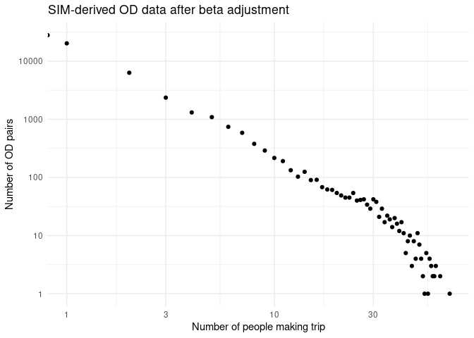
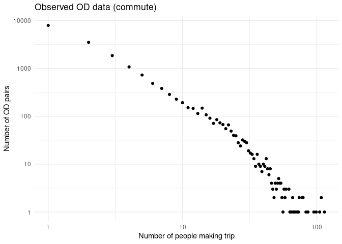
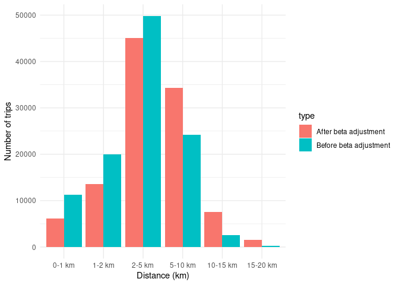

# Utility trips methodology
Joey Talbot and Robin Lovelace
2024-05-20

## Trip numbers and purposes

We estimated trips for three everyday purposes (in addition to commuting
and travel to school):

- shopping
- social (visiting friends and family)
- leisure

These are presented in a single network layer under the joint category
of ‘Other Everyday’ trips.

We used data from England’s National Travel Survey 2019 to estimate the
total number of trips undertaken per person per day, as AADT. This gives
an average of 953 trips per person per year, which equates to 2.61 trips
per person per day. A trip is defined as a one-way course of travel from
one place to another
(https://www.gov.uk/government/statistics/national-travel-survey-2022-technical-report/national-travel-survey-2022-technical-report-glossary#trip).

Data on the number of trips per person per year is not available for
Scotland after 2012 as far as we can tell. The Scottish Household Survey
only records travel on the day before the survey. The National Travel
Survey records travel patterns over an entire week. However, for the ten
year period from 2002/03 to 2011/12, the National Travel Survey recorded
a mean of 995 trips per person per year by Scottish residents. In
England, during 2002 to 2012, there were 1023 trips per person per year
(https://assets.publishing.service.gov.uk/media/64e8b00063587000141dbfa6/nts0303.ods)

We assigned daily trips to trip purposes using the trip purpose
percentage breakdown from the Scottish Household Survey, Table TD3 of
the Transport and Travel in Scotland 2019 travel diary tables (after
adjusting these percentages to remove the ‘Go Home’ category). This
results in 25.1% of trips being assigned for shopping, 11.7% for social,
and 6.3% for leisure, compared with 23.3% for commuting
(https://www.transport.gov.scot/media/51346/transport-and-travel-in-scotland-2019-travel-diary-tables.xlsx).

The roughly equivalent purposes in the National Travel Survey for 2022
are as follows:

| NTS purpose                      | Proportion | NPT purpose |
|:---------------------------------|:-----------|:------------|
| Shopping                         | 17.5%      | Shopping    |
| Visiting friends at private home | 9.6%       | Social      |
| Visiting friends elsewhere       | 4.7%       | Social      |
| Entertainment or public activity | 6.7%       | Leisure     |

Aggregating the NTS purposes to match the NPT purposes, we find that the
mode split for the three everyday purposes in 2022 is as follows:

| NPT purpose | Proportion (NTS) | Proportion (NPT) |
|:------------|:-----------------|:-----------------|
| Leisure     | 6.7%             | 6.3%             |
| Shopping    | 17.5%            | 25.1%            |
| Social      | 14.3%            | 11.7%            |

The evolution of overall mode split from 2012 to 2022 in England is
shown below:

## Trip distances by purpose

Data on the distribution of trip distances (what % of trips are 0-2, 2-5
km etc) is important for the uptake model. We took data from the
National Travel Survey, shown below, as the basis of average trip
lengths for the three everyday purposes, as shown in the table below.

| NPT purpose | Average length (miles) | Av (km) | Average length (relative to commuting) |
|:------------|-----------------------:|--------:|---------------------------------------:|
| Commuting   |                   8.47 |   13.64 |                                   1.00 |
| Education   |                   2.91 |    4.68 |                                   0.34 |
| Leisure     |                   7.22 |   11.62 |                                   0.85 |
| Shopping    |                   3.77 |    6.07 |                                   0.44 |
| Social      |                   8.86 |   14.27 |                                   1.05 |

Lengths are expressed relative to the average commuting trip, the trip
purpose for which we have the best data, allowing us to more effectively
model trip distance distributions in different places (rural areas will
tend to have longer trips for all trip purposes, for example), and
allowing for the fact that absolute trip lengths vary. Note: the
assumption that the relative trip lengths are the same in Scotland as in
England is a simplification and can be tested when more detailed data is
available.

### Trip distance bands

Trip distance distributions by purpose are not available in open
summaries of the Scottish Household Survey or National Travel Survey
that we have seen. We therefore use trip distance-frequency
distributions for known commuting trips in Scotland, and adjust them
based on the relative average trip lengths for the other purposes
outlined above, to ensure realistic trip distance distributions for the
other purposes.

The approach is illustrated in the graphs of trip distance distributions
below:

We will model the number of trips as a function of distance using
exponential decay, with the following functional form:

$$
N = \alpha \exp(d \beta)
$$

where $N$ is the number of trips, $d$ is the distance, and $\alpha$ and
$\beta$ are parameters to be estimated.

Taking the log of both sides gives:

$$
\log(N) = \log(\alpha) + d \beta
$$

This allows us to model the number of trips as a linear function of
distance, to estimate the decay parameter $\alpha$. As shown in the
graph below, this approach fits the data well (note: the observed
commute data only goes to 30 km as this was the cutoff used when
processing the raw origin-destination data and converting to geographic
desire lines from which distances can be calculated):

The value of $log(\alpha)$ and $\beta$ for Euclidean distances (used as
the basis of the spatial interaction model) are estimated as follows:

         (Intercept) average_distance 
           -2.148291        -0.111557 

Knowing the relative average trip lengths for the three everyday
purposes, we can adjust the decay parameter $\beta$ to reflect the
different trip lengths for the different purposes. The modelled and
empirical mean distances implied from the Scottish commute data above
are shown in the table below:

| NPT purpose                       | Average distance (km) | %1-2  | %2-5  |
|:----------------------------------|----------------------:|:------|:------|
| Commuting (observed, up to 30km)  |                 10.78 | 12.1% | 18.0% |
| Commuting (modelled, up to 100km) |                 11.70 | 9.9%  | 16.7% |

We fitted $\beta$ parameters to ensure that the relative average trip
lengths matched the relative average trip lengths for the three everyday
purposes. Summary visualisations of the fitting process are shown below.

Target average trip lengths, and associated $\beta$ values, are shown in
the table below:

| NPT purpose | Average length (relative to commuting) | Average route distance km |   beta |
|:------------|---------------------------------------:|--------------------------:|-------:|
| Commuting   |                                  1.000 |                     11.70 | -0.086 |
| Education   |                                  0.343 |                      4.02 | -0.261 |
| Leisure     |                                  0.852 |                      9.97 | -0.101 |
| Shopping    |                                  0.445 |                      5.20 | -0.195 |
| Social      |                                  1.046 |                     12.23 | -0.082 |

The resulting trip distance distributions for the three everyday
purposes are shown in the graph below:

The approach allows us to estimate the proportion and overall number of
trips in every distance band of arbitrary width for each purpose. For
the purposes of this study and to ensure the results are straightforward
to interpret, we will use the same 0-1, 1-2, 2-5, 5-10, 10-15, 15-20,
and 20+ km distance bands as used in the commute model, with 0-1 and 20+
km bands omitted from the routing and uptake model as they are deemed
too short and too long to cycle, respectively.

The results are summarised in the table below:

| NPT purpose | 0-1 km | 1-2 km | 2-5 km | 5-10 km | 10-15 km | 15-20 km | 20+ km | Total |
|:------------|-------:|-------:|-------:|--------:|---------:|---------:|-------:|------:|
| Commuting   |   8.13 |   7.55 |  13.29 |   20.64 |    14.64 |     8.12 |  27.63 |   100 |
| Education   |  22.35 |  17.82 |  24.33 |   23.02 |     8.09 |     2.39 |   2.00 |   100 |
| Leisure     |   9.47 |   8.68 |  14.95 |   22.22 |    14.84 |     7.80 |  22.04 |   100 |
| Shopping    |  17.29 |  14.60 |  21.94 |   24.97 |    11.46 |     4.31 |   5.42 |   100 |
| Social      |   7.76 |   7.23 |  12.81 |   20.13 |    14.52 |     8.17 |  29.38 |   100 |

The results were saved in a config file to form the basis of the spatial
interaction model that generates the origin-destination data for utility
trips. A simplified version of the previous table, focussing on the
percentage of trips that are in our model, is shown below:

| NPT purpose | Modelled cycling trips (%) | Too short (%) | Too long (%) |
|:------------|---------------------------:|--------------:|-------------:|
| Commuting   |                      64.24 |          8.13 |        27.63 |
| Education   |                      75.64 |         22.35 |         2.00 |
| Leisure     |                      68.48 |          9.47 |        22.04 |
| Shopping    |                      77.29 |         17.29 |         5.42 |
| Social      |                      62.86 |          7.76 |        29.38 |

### NPT route level results

         Min.   1st Qu.    Median      Mean   3rd Qu.      Max. 
      0.07464   1.87457   5.84856  18.45035  20.82169  99.99670 

Let’s take a look at the route level results for the three everyday
purposes. The numbers of trips by purpose and distance bands are
summarised in the table below:

| purpose  |    0-1 |    1-2 |     2-5 |   5-10 | 10-15 | 15-20 | 20+ |   Total |
|:---------|-------:|-------:|--------:|-------:|------:|------:|----:|--------:|
| leisure  |  38050 | 168973 |  354994 | 113680 |  2904 |   403 | 304 |  679307 |
| shopping | 171623 | 679136 | 1401152 | 411352 | 10901 |   465 | 302 | 2674932 |
| visiting |  87041 | 325668 |  606880 | 182640 |  3247 |   235 | 146 | 1205857 |

Expressed as percentages of the total number of trips in each distance
band, the results are as follows:

| mode | purpose  | 0-1 | 1-2 | 2-5 | 5-10 | 10-15 | 15-20 | 20+ |
|:-----|:---------|----:|----:|----:|-----:|------:|------:|----:|
| all  | leisure  |   6 |  25 |  52 |   17 |     0 |     0 |   0 |
| all  | shopping |   6 |  25 |  52 |   15 |     0 |     0 |   0 |
| all  | visiting |   7 |  27 |  50 |   15 |     0 |     0 |   0 |

Given the Scottish population of around 5.5 million, the results imply
that 0.5 trips per day are made for shopping in the 0 to 10 km band
(100% of shopping trips).

Given that 25.1% of trips are for shopping and the dailing number of
trips per person is 2.61, this implies that 0.65511 trips per person per
day are for shopping *for all distances*. That value multiplied by 0.773
(the percent of trips in the 1-20 km range is 77.3%), gives the number
of shopping trips we would expect in NPT flows: 0.5064.

## Mode share

The mode shares were estimated using the mean mode shares from the
Scottish Household Survey travel diaries in Table TD2 of Transport and
Travel in Scotland 2019
(https://www.transport.gov.scot/media/51346/transport-and-travel-in-scotland-2019-travel-diary-tables.xlsx).
This gives mode shares (for social and leisure trips) of 1.2% for
cycling, 22.1% for walking, 65.2% for car, 9.3% for public transport,
and 2.2% for taxi/other.

For shopping, we assumed that the cycle mode share was half of this,
with the mode share for the other modes (car, public transport, walking
and taxi/other) increased accordingly. This follows our detailed
analysis of Scottish Household Survey travel diaries, which identified
shopping as having a considerably lower cycle mode share than other trip
purposes. Shopping trips can be more difficult to cycle, since they
require carrying larger volumes of luggage.

We used a ‘commute multiplier’ to reflect the fact that cycling for
utility (and other purposes) is not uniformly spread geographically. In
places with double the average cycling commute mode share, we assumed
that the cycling mode share for utility trips would be double the
average cycling mode share for utility trips.

## Trip origins and destinations

Origins and destinations were assigned to administrative zones.
Initially we used the larger Intermediate Zones, but we later switched
to the smaller Data Zones.

The trip origins were assumed to be people’s homes, represented by
Output Area centroids (OAs), the smallest geographical unit for which
census data is available.

The number of trips originating from each zone is therefore a function
of the residential population of the zone, multiplied by the AADT for
the given trip purpose.

For shopping and leisure trips, we used Ordnance Survey Points of
Interest (POIs) to identify trip destinations. All of these POIs were
assigned to the nearest point on a 500m grid, giving a density index for
each grid point. The grid was clipped to avoid any destination points
falling offshore.

The POIs for shopping comprised any location classed as ‘Retail.’ For
leisure, they comprised locations classed as ‘Sport and Entertainment.’
This includes gyms, swimming pools, sports centres, nightclubs, cinemas,
theatres, casinos and similar venues. We chose this category because it
matches the Scottish Household Survey ‘Sport/Entertainment’ trip
purpose.

For social trips, the destinations were people’s homes, so the number of
trips arriving in each zone was a function of the zone’s residential
population.

## Spatial interaction model

We used a spatial interaction model to pair trip origins and
destinations and thus create desire lines. These are assigned according
to a distance decay equation, which has been derived from distances of
travel to work.

The inputs for the spatial interaction model are:

- `grid`: a grid of points across the region for aggregating origins
- `oas`: Output Areas (OAs) for the region
- `os_pois`: Points of Interest (POIs) for the region
- `trip_purposes`: the trip purposes for which we are modelling desire
  lines
- a `zones` object with known residential poulation for each zone
- `parameters`: the parameters for the model
- `region_boundary_buffered`: the boundary of the region, buffered to
  ensure that all zones are included

The inputs are illustrated below for Aberdeen:

The output of the SIM model, for Aberdeen and North East is shown below.

Illustrations of the spatial interaction model results are shown below.

Let’s create the equivalent graphs for a single origin zone.

The results demonstrate how the previous `beta` value led to an
over-emphasis on short trips.

We checked the number of shopping originating in each zone according to
the synthetic OD data and found, as expected, a perfect correlation with
population, implying constant trip rates per person.

Regardless of the beta value used, spatial interaction models lead to OD
data with a highly skewed distribution of trip lengths. This can be
illustrated by plotting the number of OD pairs with different trip
numbers against the number of people making that trip, as shown below.

An feature of all OD datasets we use in this project, whether synthetic
or observed, is that they are highly skewed, with a large number of OD
pairs with very few trips. The proportion of OD pairs and trips
associated with synthetic shopping OD pairs with a given number of trips
is shown in the table below.

|   n |  n_od | n_trips | proportion_pairs | proportion_trips |
|----:|------:|--------:|-----------------:|-----------------:|
|   0 | 27932 |    6537 |             0.44 |             0.06 |
|   1 | 20213 |   18271 |             0.32 |             0.17 |
|   2 |  6308 |   12048 |             0.10 |             0.11 |
|   3 |  2357 |    6925 |             0.04 |             0.06 |
|   4 |  1310 |    5194 |             0.02 |             0.05 |
|   5 |  1088 |    5403 |             0.02 |             0.05 |
|   6 |   741 |    4432 |             0.01 |             0.04 |
|   7 |   585 |    4074 |             0.01 |             0.04 |
|   8 |   378 |    3004 |             0.01 |             0.03 |
|   9 |   290 |    2596 |             0.00 |             0.02 |
|  10 |   216 |    2159 |             0.00 |             0.02 |

The equivalent table for the observed commute OD data is shown below.

|   n | n_od | n_trips | proportion_pairs | proportion_trips |
|----:|-----:|--------:|-----------------:|-----------------:|
|   1 | 7888 |    7888 |             0.43 |             0.10 |
|   2 | 3496 |    6992 |             0.19 |             0.09 |
|   3 | 1847 |    5541 |             0.10 |             0.07 |
|   4 | 1072 |    4288 |             0.06 |             0.06 |
|   5 |  726 |    3630 |             0.04 |             0.05 |
|   6 |  485 |    2910 |             0.03 |             0.04 |
|   7 |  381 |    2667 |             0.02 |             0.04 |
|   8 |  285 |    2280 |             0.02 |             0.03 |
|   9 |  227 |    2043 |             0.01 |             0.03 |
|  10 |  192 |    1920 |             0.01 |             0.03 |

To avoid the situation whereby a large number of relatively unimportant
OD pairs account for the majority of the computational resources (around
80% of OD pairs accounting for only 20% of travel in the table above),
we will set a limit on the number of OD pairs per origin zone,
proportion to the number of trips made from that zone, and sample that
many OD pairs, with weights proportional to the interaction value. The
updated OD data is illustrated below.

The number of trips associated with each distance band for the case
study area of Aberdeen is illustrated below.

# Jittering

The resulting desire lines are put ‘jittered’. We then filter the desire
lines, excluding those with a Euclidean distance of \<500m (below this
distance people are likely to walk rather than cycle) or \>5km (to
reduce the computational time of the routing).

## Routing

Finally, the desire lines are routed on the road network, using the
CycleStreets routing algorithms for fast and quiet routes. Individual
routes are then combined into a route network.

## Route network results

The results of the the utility trip uptake model and routing are added
onto the commute and education network layers and can be visualised in
the website. An example of the route network results for central
Aberdeen is shown below.

# Next steps

The approach outlined above has been validated and quality assured, with
reproducible code reviewed by a second analyst. There are a number of
ways in which we can improve the accuracy of results in Phase 3, in
rough descending order of priority:

- Account for the fact that trip rates are note the same across zones:
  rural areas are known to have lower trip rates than urban areas, and
  longer distance trips are known to be made less frequently.
- Refine the weighting associated with each grid point in the spatial
  interaction model, to account for the fact that some destinations
  (e.g. large supermarkets for shopping trips) are larger trip
  attractors than others.
- Revisit the grid: should a more approach e.g. involving spatial
  clustering of points be used?
- Use additional data to estimate mode split under the Baseline scenario
